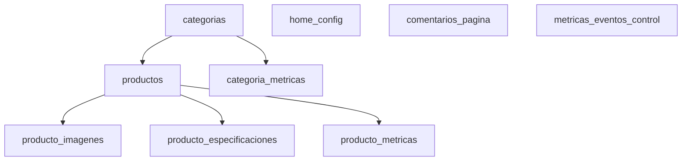

# Esquema Supabase: tablas e indices

Objetivo: recrear la base de datos desde cero en Supabase con todas las tablas que usa esta API.

> Ejecuta el bloque **SQL completo para Supabase** en el SQL Editor de Supabase. El orden importa porque hay tablas con `REFERENCES`.

## Mapa rapido



## Tablas usadas por la API

| Tabla | Para que sirve |
|---|---|
| `categorias` | Categorias del catalogo publico y admin |
| `productos` | Productos del catalogo publico y admin |
| `producto_imagenes` | Imagenes por producto, URL y `public_id` de Cloudinary |
| `producto_especificaciones` | Ficha tecnica por producto |
| `home_config` | Configuracion de tienda, banners de texto, header, limites y comentarios |
| `comentarios_pagina` | Comentarios enviados por usuarios |
| `producto_metricas` | Vistas acumuladas por producto |
| `categoria_metricas` | Vistas acumuladas por categoria |
| `metricas_eventos_control` | Control anti-duplicado para vistas por IP/user-agent |

## SQL completo para Supabase

```sql
-- =========================================================
-- ESQUEMA COMPLETO SOSAIMPOR API - SUPABASE
-- Fecha de preparacion: 2026-06-11
-- =========================================================

-- Necesario para indices GIN con busquedas ILIKE '%texto%'.
CREATE EXTENSION IF NOT EXISTS pg_trgm;

-- =========================================================
-- FUNCION GENERICA PARA actualizado_en
-- =========================================================
CREATE OR REPLACE FUNCTION public.set_actualizado_en()
RETURNS trigger AS $$
BEGIN
  NEW.actualizado_en = NOW();
  RETURN NEW;
END;
$$ LANGUAGE plpgsql;

-- =========================================================
-- 1. CATEGORIAS
-- Usada por:
-- - src/models/categorias.model.js
-- - src/models/productos.model.js
-- - src/models/admin.dashboard.model.js
-- =========================================================
CREATE TABLE IF NOT EXISTS public.categorias (
  id INTEGER GENERATED BY DEFAULT AS IDENTITY PRIMARY KEY,
  nombre TEXT NOT NULL,
  slug TEXT NOT NULL,
  descripcion TEXT,
  imagen_url TEXT,
  imagen_public_id TEXT,
  color_hex TEXT,
  color_texto_hex TEXT,
  destacada BOOLEAN NOT NULL DEFAULT FALSE,
  orden_destacado INTEGER,
  activa BOOLEAN NOT NULL DEFAULT TRUE,
  creado_en TIMESTAMPTZ NOT NULL DEFAULT NOW(),

  CONSTRAINT categorias_slug_unique UNIQUE (slug),
  CONSTRAINT categorias_color_hex_formato CHECK (
    color_hex IS NULL OR color_hex ~ '^#[0-9A-Fa-f]{6}$'
  ),
  CONSTRAINT categorias_color_texto_hex_formato CHECK (
    color_texto_hex IS NULL OR color_texto_hex ~ '^#[0-9A-Fa-f]{6}$'
  )
);

-- =========================================================
-- 2. PRODUCTOS
-- Usada por:
-- - src/models/productos.model.js
-- - src/models/producto-imagenes.model.js
-- - src/models/producto-especificaciones.model.js
-- - src/models/producto-metricas.model.js
-- - src/models/admin.dashboard.model.js
-- =========================================================
CREATE TABLE IF NOT EXISTS public.productos (
  id INTEGER GENERATED BY DEFAULT AS IDENTITY PRIMARY KEY,
  categoria_id INTEGER REFERENCES public.categorias(id) ON DELETE SET NULL,
  nombre TEXT NOT NULL,
  slug TEXT NOT NULL,
  descripcion TEXT,
  tipo_producto TEXT,
  marca TEXT,
  modelo TEXT,
  anio INTEGER,
  codigo_producto TEXT,
  condicion TEXT,
  precio NUMERIC(12, 2) NOT NULL DEFAULT 0,
  stock INTEGER NOT NULL DEFAULT 0,
  proximamente BOOLEAN NOT NULL DEFAULT FALSE,
  destacado BOOLEAN NOT NULL DEFAULT FALSE,
  orden_destacado INTEGER,
  activo BOOLEAN NOT NULL DEFAULT TRUE,
  creado_en TIMESTAMPTZ NOT NULL DEFAULT NOW(),
  actualizado_en TIMESTAMPTZ NOT NULL DEFAULT NOW(),

  CONSTRAINT productos_slug_unique UNIQUE (slug),
  CONSTRAINT productos_precio_no_negativo CHECK (precio >= 0),
  CONSTRAINT productos_stock_no_negativo CHECK (stock >= 0),
  CONSTRAINT productos_anio_valido CHECK (anio IS NULL OR anio BETWEEN 1900 AND 2100)
);

DROP TRIGGER IF EXISTS trg_productos_set_actualizado_en ON public.productos;
CREATE TRIGGER trg_productos_set_actualizado_en
BEFORE UPDATE ON public.productos
FOR EACH ROW
EXECUTE FUNCTION public.set_actualizado_en();

-- =========================================================
-- 3. IMAGENES DE PRODUCTO
-- Usada por:
-- - src/models/producto-imagenes.model.js
-- - src/models/productos.model.js
-- - servicios Cloudinary
-- =========================================================
CREATE TABLE IF NOT EXISTS public.producto_imagenes (
  id INTEGER GENERATED BY DEFAULT AS IDENTITY PRIMARY KEY,
  producto_id INTEGER NOT NULL REFERENCES public.productos(id) ON DELETE CASCADE,
  imagen_url TEXT NOT NULL,
  public_id TEXT,
  principal BOOLEAN NOT NULL DEFAULT FALSE,
  orden INTEGER NOT NULL DEFAULT 0,
  creado_en TIMESTAMPTZ NOT NULL DEFAULT NOW()
);

-- =========================================================
-- 4. ESPECIFICACIONES DE PRODUCTO
-- Usada por:
-- - src/models/producto-especificaciones.model.js
-- - src/models/productos.model.js
-- =========================================================
CREATE TABLE IF NOT EXISTS public.producto_especificaciones (
  id INTEGER GENERATED BY DEFAULT AS IDENTITY PRIMARY KEY,
  producto_id INTEGER NOT NULL REFERENCES public.productos(id) ON DELETE CASCADE,
  nombre TEXT NOT NULL,
  valor TEXT NOT NULL
);

-- =========================================================
-- 5. CONFIGURACION DE TIENDA / HOME
-- Usada por:
-- - src/models/configuracion.model.js
-- - src/models/categorias.model.js
-- - src/models/comentario.model.js via service
-- - src/models/admin.dashboard.model.js
-- =========================================================
CREATE TABLE IF NOT EXISTS public.home_config (
  id INTEGER GENERATED BY DEFAULT AS IDENTITY PRIMARY KEY,
  banner_primary_message TEXT,
  banner_secondary_message TEXT,
  banner_tertiary_message TEXT,
  banner_subtitle TEXT,
  banner_title TEXT,
  header_help_label TEXT,
  header_location_label TEXT,
  header_location_sub_label TEXT,
  header_phone_label TEXT,
  header_primary_message TEXT,
  header_schedule_friday TEXT,
  header_schedule_saturday TEXT,
  header_shipping_badge TEXT,
  header_secondary_message TEXT,
  header_whatsapp_label TEXT,
  header_whatsapp_sub_label TEXT,
  header_whatsapp_url TEXT,
  location_display_address TEXT,
  location_display_district TEXT,
  seller_whatsapp_url TEXT,
  featured_categories_limit INTEGER NOT NULL DEFAULT 8,
  comment_min_interval_minutes INTEGER NOT NULL DEFAULT 5,
  comment_daily_limit INTEGER NOT NULL DEFAULT 3,
  is_active BOOLEAN NOT NULL DEFAULT FALSE,
  creado_en TIMESTAMPTZ NOT NULL DEFAULT NOW(),

  CONSTRAINT home_config_featured_categories_limit_positive CHECK (featured_categories_limit > 0),
  CONSTRAINT home_config_comment_min_interval_positive CHECK (comment_min_interval_minutes > 0),
  CONSTRAINT home_config_comment_daily_limit_positive CHECK (comment_daily_limit > 0)
);

-- =========================================================
-- 6. COMENTARIOS DE PAGINA
-- Usada por:
-- - src/models/comentario.model.js
-- =========================================================
CREATE TABLE IF NOT EXISTS public.comentarios_pagina (
  id INTEGER GENERATED BY DEFAULT AS IDENTITY PRIMARY KEY,
  texto TEXT NOT NULL,
  ip_hash VARCHAR(128) NOT NULL,
  user_agent_hash VARCHAR(128),
  creado_en TIMESTAMPTZ NOT NULL DEFAULT NOW()
);

-- =========================================================
-- 7. METRICAS DE PRODUCTO
-- Usada por:
-- - src/models/producto-metricas.model.js
-- - src/models/productos.model.js
-- - src/models/admin.dashboard.model.js
-- =========================================================
CREATE TABLE IF NOT EXISTS public.producto_metricas (
  id INTEGER GENERATED BY DEFAULT AS IDENTITY PRIMARY KEY,
  producto_id INTEGER NOT NULL REFERENCES public.productos(id) ON DELETE CASCADE,
  vistas INTEGER NOT NULL DEFAULT 0,
  creado_en TIMESTAMPTZ NOT NULL DEFAULT NOW(),
  actualizado_en TIMESTAMPTZ NOT NULL DEFAULT NOW(),

  CONSTRAINT producto_metricas_producto_unique UNIQUE (producto_id),
  CONSTRAINT producto_metricas_vistas_no_negativas CHECK (vistas >= 0)
);

DROP TRIGGER IF EXISTS trg_producto_metricas_set_actualizado_en ON public.producto_metricas;
CREATE TRIGGER trg_producto_metricas_set_actualizado_en
BEFORE UPDATE ON public.producto_metricas
FOR EACH ROW
EXECUTE FUNCTION public.set_actualizado_en();

-- =========================================================
-- 8. METRICAS DE CATEGORIA
-- Usada por:
-- - src/models/categoria-metricas.model.js
-- - src/models/categorias.model.js
-- - src/models/admin.dashboard.model.js
-- =========================================================
CREATE TABLE IF NOT EXISTS public.categoria_metricas (
  id INTEGER GENERATED BY DEFAULT AS IDENTITY PRIMARY KEY,
  categoria_id INTEGER NOT NULL REFERENCES public.categorias(id) ON DELETE CASCADE,
  vistas INTEGER NOT NULL DEFAULT 0,
  creado_en TIMESTAMPTZ NOT NULL DEFAULT NOW(),
  actualizado_en TIMESTAMPTZ NOT NULL DEFAULT NOW(),

  CONSTRAINT categoria_metricas_categoria_unique UNIQUE (categoria_id),
  CONSTRAINT categoria_metricas_vistas_no_negativas CHECK (vistas >= 0)
);

DROP TRIGGER IF EXISTS trg_categoria_metricas_set_actualizado_en ON public.categoria_metricas;
CREATE TRIGGER trg_categoria_metricas_set_actualizado_en
BEFORE UPDATE ON public.categoria_metricas
FOR EACH ROW
EXECUTE FUNCTION public.set_actualizado_en();

-- =========================================================
-- 9. CONTROL DE EVENTOS DE METRICAS
-- Usada por:
-- - src/models/metricas-eventos-control.model.js
-- =========================================================
CREATE TABLE IF NOT EXISTS public.metricas_eventos_control (
  id INTEGER GENERATED BY DEFAULT AS IDENTITY PRIMARY KEY,
  tipo TEXT NOT NULL,
  referencia_id INTEGER NOT NULL,
  ip_hash VARCHAR(128) NOT NULL,
  user_agent_hash VARCHAR(128) NOT NULL,
  creado_en TIMESTAMPTZ NOT NULL DEFAULT NOW(),

  CONSTRAINT metricas_eventos_control_tipo_valido CHECK (tipo IN ('producto', 'categoria'))
);

-- =========================================================
-- INDICES: CATEGORIAS
-- =========================================================
CREATE INDEX IF NOT EXISTS idx_categorias_activa
ON public.categorias (activa);

CREATE INDEX IF NOT EXISTS idx_categorias_destacada
ON public.categorias (destacada);

CREATE INDEX IF NOT EXISTS idx_categorias_orden_destacado
ON public.categorias (orden_destacado);

CREATE INDEX IF NOT EXISTS idx_categorias_creado_en
ON public.categorias (creado_en DESC);

CREATE INDEX IF NOT EXISTS idx_categorias_publicas_destacadas
ON public.categorias (activa, destacada, orden_destacado, creado_en DESC);

CREATE INDEX IF NOT EXISTS idx_categorias_slug_lower
ON public.categorias (LOWER(slug));

CREATE INDEX IF NOT EXISTS idx_categorias_imagen_public_id
ON public.categorias (imagen_public_id);

CREATE INDEX IF NOT EXISTS idx_categorias_busqueda_trgm
ON public.categorias
USING gin ((COALESCE(nombre, '') || ' ' || COALESCE(slug, '') || ' ' || COALESCE(descripcion, '')) gin_trgm_ops);

-- =========================================================
-- INDICES: PRODUCTOS
-- =========================================================
CREATE INDEX IF NOT EXISTS idx_productos_categoria_id
ON public.productos (categoria_id);

CREATE INDEX IF NOT EXISTS idx_productos_activo
ON public.productos (activo);

CREATE INDEX IF NOT EXISTS idx_productos_destacado
ON public.productos (destacado);

CREATE INDEX IF NOT EXISTS idx_productos_proximamente
ON public.productos (proximamente);

CREATE INDEX IF NOT EXISTS idx_productos_anio
ON public.productos (anio);

CREATE INDEX IF NOT EXISTS idx_productos_precio
ON public.productos (precio);

CREATE INDEX IF NOT EXISTS idx_productos_stock
ON public.productos (stock);

CREATE INDEX IF NOT EXISTS idx_productos_creado_en
ON public.productos (creado_en DESC);

CREATE INDEX IF NOT EXISTS idx_productos_actualizado_en
ON public.productos (actualizado_en DESC);

CREATE INDEX IF NOT EXISTS idx_productos_orden_destacado
ON public.productos (orden_destacado);

CREATE INDEX IF NOT EXISTS idx_productos_slug_lower
ON public.productos (LOWER(slug));

CREATE INDEX IF NOT EXISTS idx_productos_marca_lower
ON public.productos (LOWER(marca));

CREATE INDEX IF NOT EXISTS idx_productos_modelo_lower
ON public.productos (LOWER(modelo));

CREATE INDEX IF NOT EXISTS idx_productos_tipo_producto_lower
ON public.productos (LOWER(tipo_producto));

CREATE INDEX IF NOT EXISTS idx_productos_condicion
ON public.productos (condicion);

CREATE INDEX IF NOT EXISTS idx_productos_publico_orden
ON public.productos (activo, destacado DESC, creado_en DESC, id DESC);

CREATE INDEX IF NOT EXISTS idx_productos_admin_orden
ON public.productos (creado_en DESC, id DESC);

CREATE INDEX IF NOT EXISTS idx_productos_categoria_activo
ON public.productos (categoria_id, activo);

CREATE INDEX IF NOT EXISTS idx_productos_busqueda_trgm
ON public.productos
USING gin ((COALESCE(nombre, '') || ' ' || COALESCE(marca, '') || ' ' || COALESCE(modelo, '') || ' ' || COALESCE(tipo_producto, '') || ' ' || COALESCE(codigo_producto, '')) gin_trgm_ops);

-- =========================================================
-- INDICES: PRODUCTO_IMAGENES
-- =========================================================
CREATE INDEX IF NOT EXISTS idx_producto_imagenes_producto_id
ON public.producto_imagenes (producto_id);

CREATE INDEX IF NOT EXISTS idx_producto_imagenes_producto_orden
ON public.producto_imagenes (producto_id, principal DESC, orden ASC, id ASC);

CREATE INDEX IF NOT EXISTS idx_producto_imagenes_public_id
ON public.producto_imagenes (public_id);

-- Garantiza una sola imagen principal por producto.
CREATE UNIQUE INDEX IF NOT EXISTS idx_producto_imagenes_unica_principal
ON public.producto_imagenes (producto_id)
WHERE principal = true;

-- =========================================================
-- INDICES: PRODUCTO_ESPECIFICACIONES
-- =========================================================
CREATE INDEX IF NOT EXISTS idx_producto_especificaciones_producto_id
ON public.producto_especificaciones (producto_id);

CREATE INDEX IF NOT EXISTS idx_producto_especificaciones_producto_id_id
ON public.producto_especificaciones (producto_id, id);

-- =========================================================
-- INDICES: HOME_CONFIG
-- =========================================================
CREATE INDEX IF NOT EXISTS idx_home_config_is_active
ON public.home_config (is_active);

-- Garantiza una sola configuracion activa.
CREATE UNIQUE INDEX IF NOT EXISTS idx_home_config_unica_activa
ON public.home_config (is_active)
WHERE is_active = true;

-- =========================================================
-- INDICES: COMENTARIOS_PAGINA
-- =========================================================
CREATE INDEX IF NOT EXISTS idx_comentarios_pagina_creado_en
ON public.comentarios_pagina (creado_en DESC, id DESC);

CREATE INDEX IF NOT EXISTS idx_comentarios_pagina_ip_hash_creado_en
ON public.comentarios_pagina (ip_hash, creado_en DESC);

-- =========================================================
-- INDICES: PRODUCTO_METRICAS
-- =========================================================
CREATE INDEX IF NOT EXISTS idx_producto_metricas_vistas
ON public.producto_metricas (vistas DESC);

CREATE INDEX IF NOT EXISTS idx_producto_metricas_actualizado_en
ON public.producto_metricas (actualizado_en DESC, id DESC);

-- =========================================================
-- INDICES: CATEGORIA_METRICAS
-- =========================================================
CREATE INDEX IF NOT EXISTS idx_categoria_metricas_vistas
ON public.categoria_metricas (vistas DESC);

CREATE INDEX IF NOT EXISTS idx_categoria_metricas_actualizado_en
ON public.categoria_metricas (actualizado_en DESC, id DESC);

-- =========================================================
-- INDICES: METRICAS_EVENTOS_CONTROL
-- =========================================================
CREATE INDEX IF NOT EXISTS idx_metricas_eventos_control_lookup
ON public.metricas_eventos_control (
  tipo,
  referencia_id,
  ip_hash,
  user_agent_hash,
  creado_en DESC
);

CREATE INDEX IF NOT EXISTS idx_metricas_eventos_control_creado_en
ON public.metricas_eventos_control (creado_en);

-- =========================================================
-- INSERT INICIAL RECOMENDADO
-- La API publica /api/configuracion espera una fila activa.
-- =========================================================
INSERT INTO public.home_config (
  banner_primary_message,
  banner_secondary_message,
  banner_tertiary_message,
  banner_subtitle,
  banner_title,
  header_help_label,
  header_location_label,
  header_location_sub_label,
  header_phone_label,
  header_primary_message,
  header_schedule_friday,
  header_schedule_saturday,
  header_shipping_badge,
  header_secondary_message,
  header_whatsapp_label,
  header_whatsapp_sub_label,
  header_whatsapp_url,
  location_display_address,
  location_display_district,
  seller_whatsapp_url,
  featured_categories_limit,
  comment_min_interval_minutes,
  comment_daily_limit,
  is_active
) VALUES (
  'Compra online y recoge en taller',
  'Con envios',
  'Recojo en tienda',
  'Piezas seleccionadas y verificadas para tu vehiculo',
  'REPUESTOS USADOS IMPORTADOS',
  'Necesitas ayuda?',
  'Ubicacion',
  'Ver en mapa',
  '+51 924 516 684',
  'Compra online y recoge en taller',
  'Lun - Vie: 8:00 am - 7:00 pm',
  'Sab: 8:00 am - 12:00 pm',
  'Con envios',
  'Solo recojo en tienda',
  'WhatsApp',
  'Atencion rapida',
  'https://wa.me/51924516684',
  'Av. Los Proceres 900',
  'Puente Piedra, Lima',
  'https://wa.me/51924516684',
  8,
  5,
  3,
  true
)
ON CONFLICT DO NOTHING;
```

## Verificacion rapida

Ejecuta esto despues del SQL principal para confirmar que todo quedo creado:

```sql
SELECT table_name
FROM information_schema.tables
WHERE table_schema = 'public'
  AND table_name IN (
    'categorias',
    'productos',
    'producto_imagenes',
    'producto_especificaciones',
    'home_config',
    'comentarios_pagina',
    'producto_metricas',
    'categoria_metricas',
    'metricas_eventos_control'
  )
ORDER BY table_name;
```

Ver indices:

```sql
SELECT
  schemaname,
  tablename,
  indexname,
  indexdef
FROM pg_indexes
WHERE schemaname = 'public'
  AND tablename IN (
    'categorias',
    'productos',
    'producto_imagenes',
    'producto_especificaciones',
    'home_config',
    'comentarios_pagina',
    'producto_metricas',
    'categoria_metricas',
    'metricas_eventos_control'
  )
ORDER BY tablename, indexname;
```

Ver configuracion activa:

```sql
SELECT *
FROM public.home_config
WHERE is_active = true;
```

## Variables de entorno necesarias

La base de datos sola no basta para desplegar. La API tambien necesita estas variables:

| Variable | Para que sirve |
|---|---|
| `DATABASE_URL` | Conexion a Supabase Postgres |
| `ADMIN_API_KEY` | Protege rutas `/api/admin/*` |
| `COMMENT_HASH_SECRET` | Hashea IP/user-agent en comentarios y metricas |
| `CLOUDINARY_URL` | Subida y eliminacion de imagenes de productos/categorias |

## Notas importantes

| Tema | Nota |
|---|---|
| Supabase SQL Editor | Ejecuta el SQL con el usuario owner del proyecto |
| RLS | Si habilitas RLS, crea policies o usa la conexion service role en backend; si no, la API podria fallar |
| IDs | Se usa `INTEGER GENERATED BY DEFAULT AS IDENTITY`, compatible con Supabase y evita que `node-postgres` devuelva los IDs como string |
| Configuracion activa | El indice `idx_home_config_unica_activa` evita mas de una fila activa |
| Imagen principal | El indice `idx_producto_imagenes_unica_principal` evita mas de una imagen principal por producto |
| Busquedas | `pg_trgm` mejora `ILIKE '%texto%'` en productos y categorias |
| Cloudinary | La BD guarda URL y `public_id`; los archivos no viven en Supabase |
| Comentarios y metricas | Necesitan `COMMENT_HASH_SECRET` para generar hashes estables |
