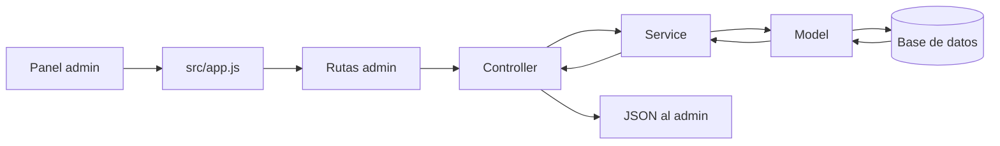
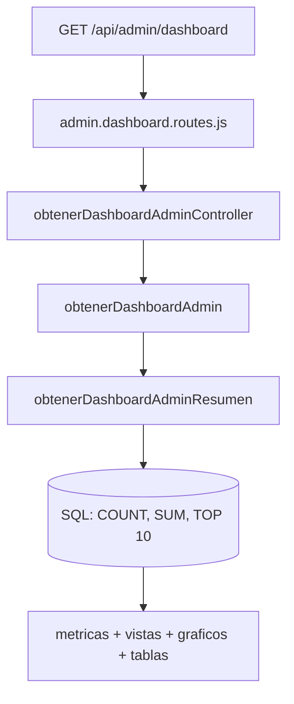
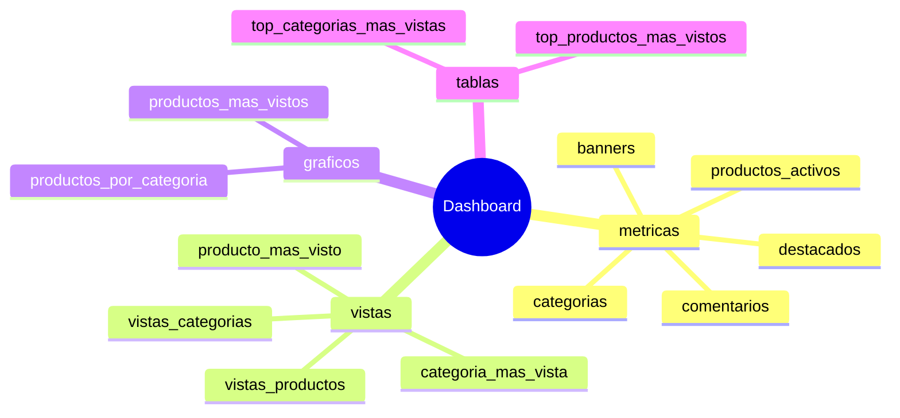
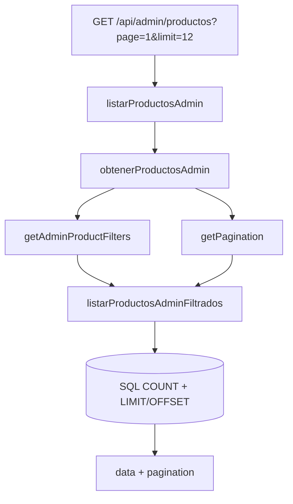
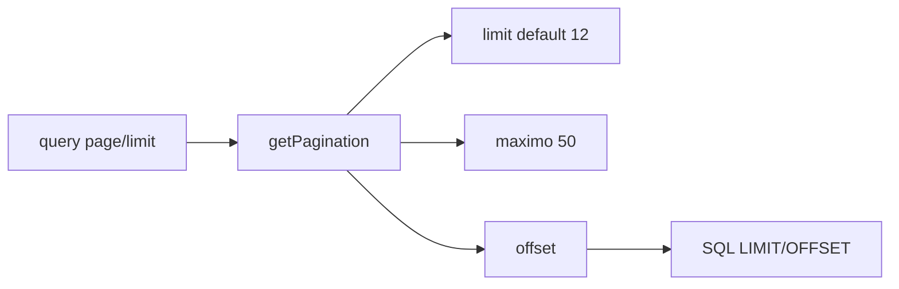
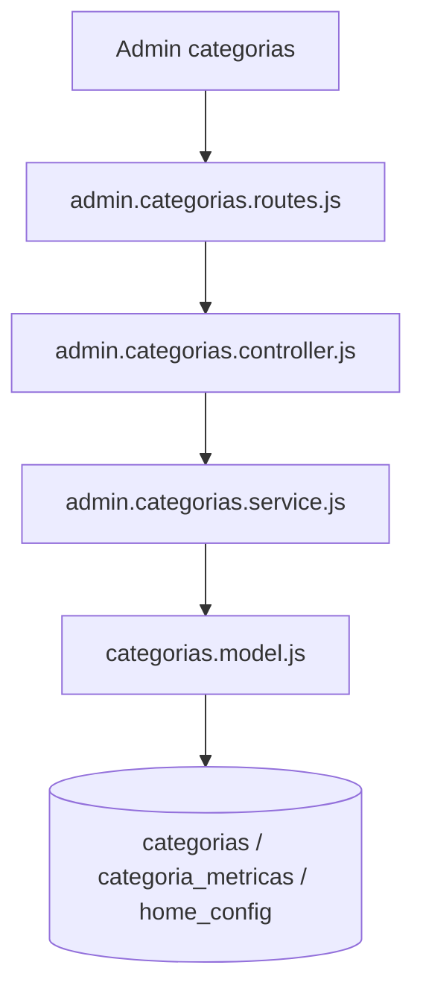
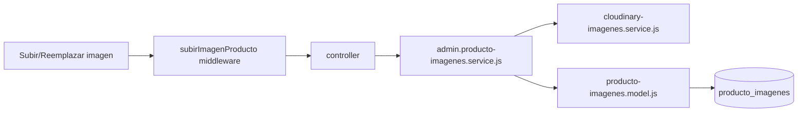
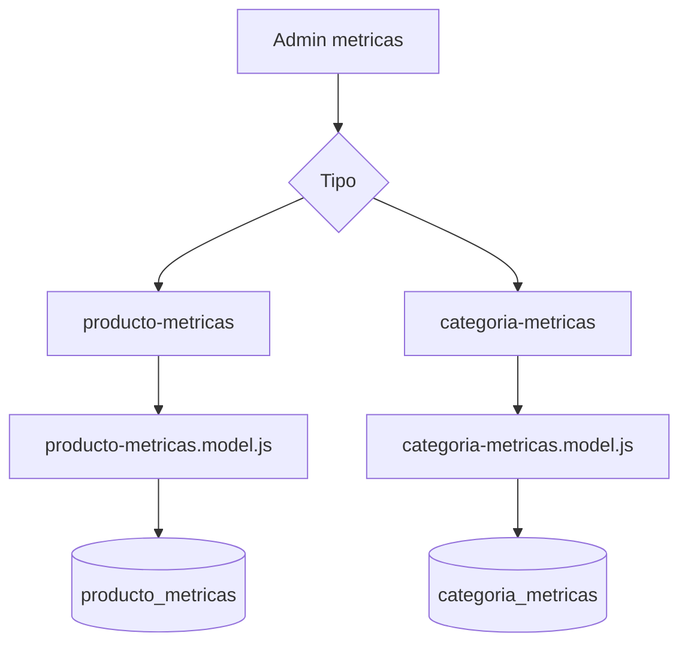
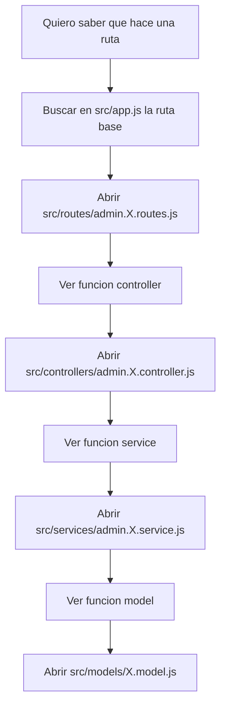

# Guia admin con graficos

Objetivo: entender rapido como funciona el API admin, que rutas existen, que archivos toca cada ruta y que funciones se ejecutan.

> Nota: en `src/app.js` las rutas admin tienen TODO de proteger con `authMiddleware` y rol admin.

## Mapa rapido

## Rutas principales

| Modulo | Ruta base | Para que sirve |
|---|---|---|
| Dashboard | `/api/admin/dashboard` | Resumen, conteos, tops y graficos |
| Productos | `/api/admin/productos` | CRUD de productos y filtros |
| Categorias | `/api/admin/categorias` | CRUD de categorias y destacadas |
| Imagenes | `/api/admin/productos/:productoId/imagenes` | Imagenes de un producto |
| Especificaciones | `/api/admin/productos/:productoId/especificaciones` | Fichas tecnicas del producto |
| Configuracion | `/api/admin/configuracion` | Configuracion de tienda/home |
| Comentarios | `/api/admin/comentarios` | Moderar comentarios |
| Metricas producto | `/api/admin/producto-metricas` | Ver/editar vistas de productos |
| Metricas categoria | `/api/admin/categoria-metricas` | Ver/editar vistas de categorias |

## Dashboard

Ruta:

| Metodo | Endpoint | Funcion controller |
|---|---|---|
| GET | `/api/admin/dashboard` | `obtenerDashboardAdminController` |

Flujo:

Archivos y funciones:

| Archivo | Funcion |
|---|---|
| `src/routes/admin.dashboard.routes.js` | `router.get("/")` |
| `src/controllers/admin.dashboard.controller.js` | `obtenerDashboardAdminController()` |
| `src/services/admin.dashboard.service.js` | `obtenerDashboardAdmin()` |
| `src/models/admin.dashboard.model.js` | `obtenerDashboardAdminResumen()` |

Que devuelve:

Rendimiento:

| Dato | Como viene |
|---|---|
| Productos mas vistos | Limitado a `TOP_LIMIT = 10` |
| Categorias mas vistas | Limitado a `TOP_LIMIT = 10` |
| Productos por categoria | Trae todas las categorias, pero solo con conteo |
| Listados completos | No trae todos los productos completos |

## Productos

Rutas:

| Metodo | Endpoint | Funcion controller |
|---|---|---|
| GET | `/api/admin/productos` | `listarProductosAdmin` |
| GET | `/api/admin/productos/filtros-opciones` | `listarFiltrosProductosAdmin` |
| GET | `/api/admin/productos/:id` | `obtenerProductoAdminPorIdController` |
| POST | `/api/admin/productos` | `crearProductoAdminController` |
| PUT | `/api/admin/productos/:id` | `actualizarProductoAdminController` |
| PATCH | `/api/admin/productos/:id/desactivar` | `desactivarProductoAdminController` |
| PATCH | `/api/admin/productos/:id/activar` | `activarProductoAdminController` |

Flujo de listado:

Archivos y funciones:

| Archivo | Funciones |
|---|---|
| `src/routes/admin.productos.routes.js` | Define endpoints de productos |
| `src/controllers/admin.productos.controller.js` | `listarProductosAdmin`, `listarFiltrosProductosAdmin`, `obtenerProductoAdminPorIdController`, `crearProductoAdminController`, `actualizarProductoAdminController`, `desactivarProductoAdminController`, `activarProductoAdminController` |
| `src/services/admin.productos.service.js` | `obtenerProductosAdmin`, `obtenerFiltrosProductosAdmin`, `obtenerProductoAdmin`, `crearProducto`, `actualizarProducto`, `desactivarProducto`, `activarProducto` |
| `src/models/productos.model.js` | `listarProductosAdminFiltrados`, `obtenerOpcionesFiltrosProductosAdmin`, `obtenerProductoAdminPorId`, `categoriaProductoExiste`, `crearProductoAdmin`, `actualizarProductoAdmin`, `desactivarProductoAdmin`, `activarProductoAdmin` |
| `src/utils/pagination.js` | `getPagination` |
| `src/utils/filters.js` | `getAdminProductFilters` |

Paginacion:

## Categorias

Rutas:

| Metodo | Endpoint | Funcion controller |
|---|---|---|
| GET | `/api/admin/categorias` | `listarCategoriasAdmin` |
| GET | `/api/admin/categorias/configuracion/destacadas` | `obtenerConfiguracionCategoriasDestacadasController` |
| PATCH | `/api/admin/categorias/configuracion/destacadas` | `actualizarConfiguracionCategoriasDestacadasController` |
| GET | `/api/admin/categorias/:id` | `obtenerCategoriaAdminPorIdController` |
| POST | `/api/admin/categorias` | `crearCategoriaAdminController` |
| PUT | `/api/admin/categorias/:id` | `actualizarCategoriaAdminController` |
| PATCH | `/api/admin/categorias/:id/desactivar` | `desactivarCategoriaAdminController` |
| PATCH | `/api/admin/categorias/:id/activar` | `activarCategoriaAdminController` |
| DELETE | `/api/admin/categorias/:id` | `desactivarCategoriaAdminController` |

Flujo:

Archivos y funciones:

| Archivo | Funciones |
|---|---|
| `src/routes/admin.categorias.routes.js` | Define endpoints de categorias |
| `src/controllers/admin.categorias.controller.js` | `listarCategoriasAdmin`, `obtenerConfiguracionCategoriasDestacadasController`, `actualizarConfiguracionCategoriasDestacadasController`, `obtenerCategoriaAdminPorIdController`, `crearCategoriaAdminController`, `actualizarCategoriaAdminController`, `desactivarCategoriaAdminController`, `activarCategoriaAdminController` |
| `src/services/admin.categorias.service.js` | `obtenerCategoriasAdmin`, `obtenerConfiguracionCategoriasDestacadas`, `actualizarConfiguracionCategoriasDestacadas`, `obtenerCategoriaAdmin`, `crearCategoria`, `actualizarCategoria`, `desactivarCategoria`, `activarCategoria` |
| `src/models/categorias.model.js` | `listarCategoriasAdminFiltradas`, `obtenerLimiteCategoriasDestacadasConfig`, `actualizarLimiteCategoriasDestacadasConfig`, `obtenerCategoriaAdminPorId`, `crearCategoriaAdmin`, `actualizarCategoriaAdmin`, `desactivarCategoriaAdmin`, `activarCategoriaAdmin` |

## Imagenes de producto

Rutas:

| Metodo | Endpoint | Funcion controller |
|---|---|---|
| GET | `/api/admin/productos/:productoId/imagenes` | `listarImagenesProductoAdminController` |
| GET | `/api/admin/productos/:productoId/imagenes/:imagenId` | `obtenerImagenProductoAdminPorIdController` |
| POST | `/api/admin/productos/:productoId/imagenes` | `subirImagenProducto` + `crearImagenProductoAdminController` |
| PUT | `/api/admin/productos/:productoId/imagenes/:imagenId` | `actualizarImagenProductoAdminController` |
| PATCH | `/api/admin/productos/:productoId/imagenes/:imagenId/principal` | `marcarImagenProductoPrincipalAdminController` |
| PUT | `/api/admin/productos/:productoId/imagenes/:imagenId/reemplazar` | `subirImagenProducto` + `reemplazarImagenProductoAdminController` |
| DELETE | `/api/admin/productos/:productoId/imagenes/:imagenId` | `eliminarImagenProductoAdminController` |

Flujo:

Funciones clave:

| Archivo | Funciones |
|---|---|
| `src/services/admin.producto-imagenes.service.js` | `obtenerImagenesProductoAdmin`, `obtenerImagenProductoAdmin`, `crearImagenProducto`, `actualizarImagenProducto`, `marcarImagenProductoPrincipal`, `reemplazarImagenProducto`, `eliminarImagenProducto` |
| `src/models/producto-imagenes.model.js` | `productoImagenProductoExiste`, `listarImagenesProductoAdmin`, `obtenerImagenProductoAdminPorId`, `crearImagenProductoAdmin`, `actualizarImagenProductoAdmin`, `marcarImagenProductoAdminPrincipal`, `reemplazarImagenProductoAdmin`, `eliminarImagenProductoAdmin` |

## Especificaciones de producto

Rutas:

| Metodo | Endpoint | Funcion controller |
|---|---|---|
| GET | `/api/admin/productos/:productoId/especificaciones` | `listarEspecificacionesProductoAdminController` |
| GET | `/api/admin/productos/:productoId/especificaciones/:especificacionId` | `obtenerEspecificacionProductoAdminPorIdController` |
| POST | `/api/admin/productos/:productoId/especificaciones` | `crearEspecificacionProductoAdminController` |
| PUT | `/api/admin/productos/:productoId/especificaciones/:especificacionId` | `actualizarEspecificacionProductoAdminController` |
| DELETE | `/api/admin/productos/:productoId/especificaciones/:especificacionId` | `eliminarEspecificacionProductoAdminController` |

Funciones clave:

| Archivo | Funciones |
|---|---|
| `src/services/admin.producto-especificaciones.service.js` | `obtenerEspecificacionesProductoAdmin`, `obtenerEspecificacionProductoAdmin`, `crearEspecificacionProducto`, `actualizarEspecificacionProducto`, `eliminarEspecificacionProducto` |
| `src/models/producto-especificaciones.model.js` | `productoEspecificacionProductoExiste`, `listarEspecificacionesProductoAdmin`, `obtenerEspecificacionProductoAdminPorId`, `crearEspecificacionProductoAdmin`, `actualizarEspecificacionProductoAdmin`, `eliminarEspecificacionProductoAdmin` |

## Metricas

Producto metricas:

| Metodo | Endpoint |
|---|---|
| GET | `/api/admin/producto-metricas` |
| GET | `/api/admin/producto-metricas/:productoId` |
| PUT | `/api/admin/producto-metricas/:productoId` |
| PATCH | `/api/admin/producto-metricas/:productoId` |
| PATCH | `/api/admin/producto-metricas/:productoId/reset` |
| DELETE | `/api/admin/producto-metricas/:productoId` |

Categoria metricas:

| Metodo | Endpoint |
|---|---|
| GET | `/api/admin/categoria-metricas` |
| GET | `/api/admin/categoria-metricas/:categoriaId` |
| PUT | `/api/admin/categoria-metricas/:categoriaId` |
| PATCH | `/api/admin/categoria-metricas/:categoriaId` |
| PATCH | `/api/admin/categoria-metricas/:categoriaId/reset` |
| DELETE | `/api/admin/categoria-metricas/:categoriaId` |

Mapa:

Funciones modelo:

| Archivo | Funciones |
|---|---|
| `src/models/producto-metricas.model.js` | `listarProductoMetricas`, `obtenerProductoMetricaPorProductoId`, `asegurarProductoMetrica`, `incrementarVistasProductoMetrica`, `actualizarProductoMetrica`, `resetearProductoMetrica`, `eliminarProductoMetrica` |
| `src/models/categoria-metricas.model.js` | `listarCategoriaMetricas`, `obtenerCategoriaMetricaPorCategoriaId`, `asegurarCategoriaMetrica`, `incrementarVistasCategoriaMetrica`, `actualizarCategoriaMetrica`, `resetearCategoriaMetrica`, `eliminarCategoriaMetrica` |

## Configuracion y comentarios

Configuracion:

| Metodo | Endpoint |
|---|---|
| GET | `/api/admin/configuracion` |
| GET | `/api/admin/configuracion/:id` |
| POST | `/api/admin/configuracion` |
| PUT | `/api/admin/configuracion/:id` |
| PATCH | `/api/admin/configuracion/:id` |
| DELETE | `/api/admin/configuracion/:id` |

Comentarios:

| Metodo | Endpoint |
|---|---|
| GET | `/api/admin/comentarios` |
| DELETE | `/api/admin/comentarios/vaciar` |
| GET | `/api/admin/comentarios/:id` |
| PUT | `/api/admin/comentarios/:id` |
| PATCH | `/api/admin/comentarios/:id` |
| DELETE | `/api/admin/comentarios/:id` |

Funciones clave:

| Modulo | Archivos |
|---|---|
| Configuracion | `admin.configuracion.routes.js`, `admin.configuracion.controller.js`, `configuracion.service.js`, `configuracion.model.js` |
| Comentarios | `admin.comentarios.routes.js`, `admin.comentarios.controller.js`, `comentario.service.js` |

## Como leer el codigo sin perderse

Regla simple:

| Capa | Responsabilidad |
|---|---|
| Route | Dice que URL llama a que controller |
| Controller | Recibe request y responde JSON |
| Service | Valida, limpia datos y decide que hacer |
| Model | Ejecuta SQL |
| DB | Guarda y devuelve datos |

