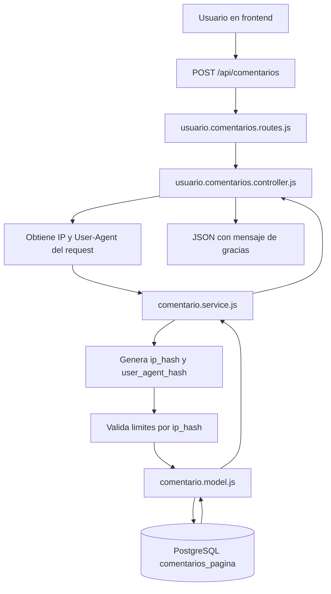
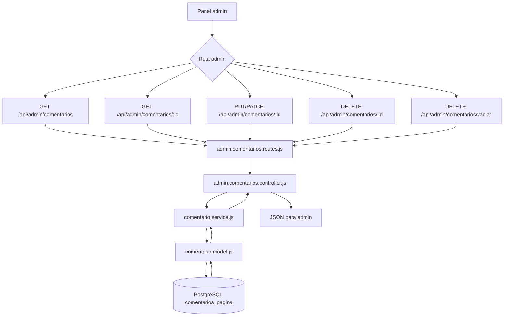

# Guia de comentarios de pagina

Esta guia explica el modulo de comentarios que guarda mensajes enviados por usuarios desde la pagina.

Tabla usada:

```sql
CREATE TABLE comentarios_pagina (
    id SERIAL PRIMARY KEY,
    texto TEXT NOT NULL,
    ip_hash VARCHAR(128) NOT NULL,
    user_agent_hash VARCHAR(128),
    creado_en TIMESTAMP DEFAULT CURRENT_TIMESTAMP
);

CREATE INDEX idx_comentarios_pagina_ip_hash_creado_en
ON comentarios_pagina (ip_hash, creado_en);

CREATE INDEX idx_comentarios_pagina_creado_en
ON comentarios_pagina (creado_en);
```

## Que hace

```txt
usuario solo puede crear comentarios
admin puede listar, ver por id, editar, eliminar y vaciar la tabla
el backend limita envios repetidos usando hashes seguros
```

## Seguridad anti-spam

El usuario solo envia:

```json
{
  "texto": "Mi mensaje"
}
```

No se recibe `ip_hash` ni `user_agent_hash` desde el body.

El backend obtiene la IP real desde el request usando este orden:

```txt
cf-connecting-ip
x-real-ip
x-forwarded-for
req.ip
req.socket.remoteAddress
```

Luego genera:

```txt
ip_hash = HMAC-SHA-256(IP real + COMMENT_HASH_SECRET)
user_agent_hash = HMAC-SHA-256(User-Agent + COMMENT_HASH_SECRET)
```

Importante:

```txt
no se guarda la IP real
no se exponen hashes en la respuesta
los listados admin tampoco devuelven hashes
```

Variable requerida en `.env`:

```env
COMMENT_HASH_SECRET=un_texto_largo_secreto_y_dificil_de_adivinar
```

Limites actuales por `ip_hash`:

```txt
maximo 1 comentario cada 5 minutos
maximo 3 comentarios cada 24 horas
```

## Rutas usuario

### Crear comentario

```http
POST /api/comentarios
```

Body:

```json
{
  "texto": "Quiero consultar por un repuesto"
}
```

Respuesta:

```json
{
  "ok": true,
  "data": {
    "message": "gracias por registrar tu comentario.",
    "comentario": {
      "id": 1,
      "texto": "Quiero consultar por un repuesto",
      "creado_en": "2026-05-29T23:30:00.000Z"
    }
  },
  "pagination": null
}
```

El usuario no tiene rutas para listar, editar, eliminar ni buscar por id.

Si supera el limite anti-spam:

```json
{
  "ok": false,
  "message": "Ya recibimos tu sugerencia. Podrás enviar otra más adelante.",
  "pagination": null
}
```

## Rutas admin

Base:

```http
/api/admin/comentarios
```

### Listar comentarios

```http
GET /api/admin/comentarios
```

Respuesta:

```json
{
  "ok": true,
  "data": [
    {
      "id": 2,
      "texto": "Necesito informacion de un motor",
      "creado_en": "2026-05-29T23:35:00.000Z"
    },
    {
      "id": 1,
      "texto": "Quiero consultar por un repuesto",
      "creado_en": "2026-05-29T23:30:00.000Z"
    }
  ],
  "pagination": null
}
```

Orden:

```txt
creado_en DESC, id DESC
```

### Obtener comentario por id

```http
GET /api/admin/comentarios/:id
```

Ejemplo:

```http
GET /api/admin/comentarios/1
```

Respuesta:

```json
{
  "ok": true,
  "data": {
    "id": 1,
    "texto": "Quiero consultar por un repuesto",
    "creado_en": "2026-05-29T23:30:00.000Z"
  },
  "pagination": null
}
```

### Editar comentario

```http
PUT /api/admin/comentarios/:id
PATCH /api/admin/comentarios/:id
```

Body:

```json
{
  "texto": "Comentario corregido desde admin"
}
```

Respuesta:

```json
{
  "ok": true,
  "data": {
    "id": 1,
    "texto": "Comentario corregido desde admin",
    "creado_en": "2026-05-29T23:30:00.000Z"
  },
  "pagination": null
}
```

### Eliminar comentario

```http
DELETE /api/admin/comentarios/:id
```

Respuesta:

```json
{
  "ok": true,
  "data": {
    "id": 1,
    "texto": "Comentario corregido desde admin",
    "creado_en": "2026-05-29T23:30:00.000Z"
  },
  "pagination": null
}
```

### Vaciar tabla

```http
DELETE /api/admin/comentarios/vaciar
```

Respuesta:

```json
{
  "ok": true,
  "data": {
    "eliminados": 10
  },
  "pagination": null
}
```

Esta ruta ejecuta:

```sql
TRUNCATE TABLE comentarios_pagina RESTART IDENTITY;
```

Eso elimina todos los comentarios y reinicia el contador `id`.

## Archivos usados

| Archivo | Funcion |
| --- | --- |
| `src/app.js` | Monta `/api/comentarios` y `/api/admin/comentarios` |
| `src/routes/usuario.comentarios.routes.js` | Define `POST /api/comentarios` |
| `src/controllers/usuario.comentarios.controller.js` | Crea comentario y responde mensaje de gracias |
| `src/routes/admin.comentarios.routes.js` | Define rutas admin de comentarios |
| `src/controllers/admin.comentarios.controller.js` | Recibe peticiones admin y responde JSON |
| `src/services/comentario.service.js` | Valida `id`, valida `texto`, obtiene IP/User-Agent, genera hashes y valida limites |
| `src/models/comentario.model.js` | Ejecuta SQL sobre `comentarios_pagina`, cuenta comentarios recientes y guarda hashes |
| `src/config/db.js` | Exporta el pool PostgreSQL |
| `src/utils/response.js` | Da formato `{ ok, data, pagination }` |
| `src/middlewares/error.middleware.js` | Devuelve errores, incluyendo `429` con `pagination: null` |
| `.env` | Define `COMMENT_HASH_SECRET` para generar hashes |

## Diagrama usuario



## Diagrama admin



## Flujo por capas

Crear comentario usuario:

```txt
POST /api/comentarios
  -> usuario.comentarios.routes.js
  -> crearComentarioUsuarioController()
  -> obtiene IP real y User-Agent desde req
  -> crearComentario(body, requestInfo)
  -> genera ip_hash y user_agent_hash con COMMENT_HASH_SECRET
  -> contarComentariosRecientesPorIpHash(ip_hash)
  -> valida 1 comentario cada 5 minutos y 3 cada 24 horas
  -> crearComentarioPagina()
  -> INSERT INTO comentarios_pagina (texto, ip_hash, user_agent_hash)
```

Listar admin:

```txt
GET /api/admin/comentarios
  -> admin.comentarios.routes.js
  -> listarComentariosAdminController()
  -> obtenerComentariosAdmin()
  -> listarComentariosPagina()
  -> SELECT id, texto, creado_en FROM comentarios_pagina
```

Editar admin:

```txt
PATCH /api/admin/comentarios/:id
  -> actualizarComentarioAdminController()
  -> actualizarComentarioAdmin(id, body)
  -> actualizarComentarioPagina(id, data)
  -> UPDATE comentarios_pagina SET texto = $1 WHERE id = $2
```

Eliminar admin:

```txt
DELETE /api/admin/comentarios/:id
  -> eliminarComentarioAdminController()
  -> eliminarComentarioAdmin(id)
  -> eliminarComentarioPagina(id)
  -> DELETE FROM comentarios_pagina WHERE id = $1
```

Vaciar admin:

```txt
DELETE /api/admin/comentarios/vaciar
  -> vaciarComentariosAdminController()
  -> vaciarComentariosAdmin()
  -> vaciarComentariosPagina()
  -> TRUNCATE TABLE comentarios_pagina RESTART IDENTITY
```

## Errores comunes

Texto vacio:

```json
{
  "ok": false,
  "message": "texto es obligatorio"
}
```

Limite anti-spam:

```json
{
  "ok": false,
  "message": "Ya recibimos tu sugerencia. Podrás enviar otra más adelante.",
  "pagination": null
}
```

Falta `COMMENT_HASH_SECRET`:

```json
{
  "ok": false,
  "message": "Configuracion de comentarios incompleta"
}
```

Id invalido:

```json
{
  "ok": false,
  "message": "id de comentario invalido"
}
```

Comentario no encontrado:

```json
{
  "ok": false,
  "message": "Comentario no encontrado"
}
```

## Pendientes recomendados

```txt
proteger rutas /api/admin/comentarios con auth y rol admin
agregar limite de longitud para texto si el frontend lo requiere
agregar paginacion al listado admin si llegan muchos comentarios
rotar COMMENT_HASH_SECRET solo si aceptas perder continuidad del limite por IP
```
