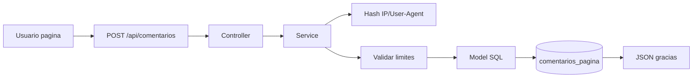
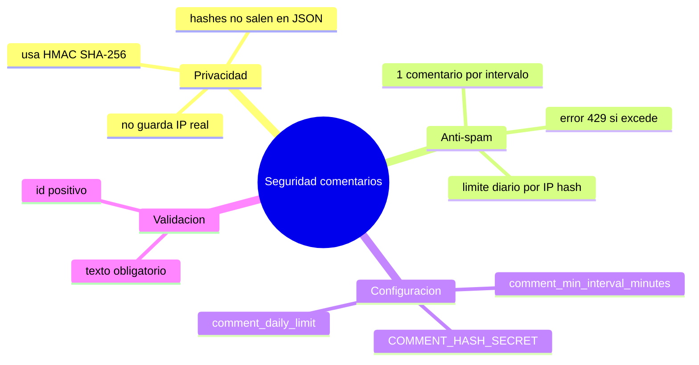
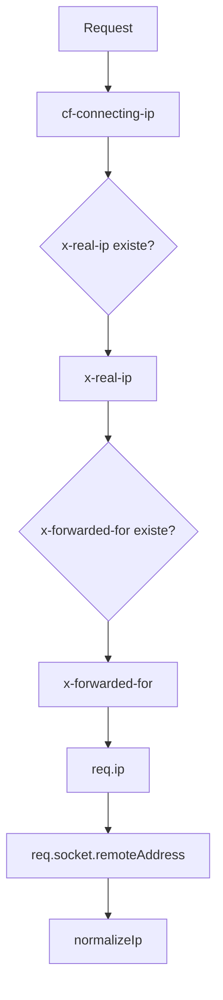
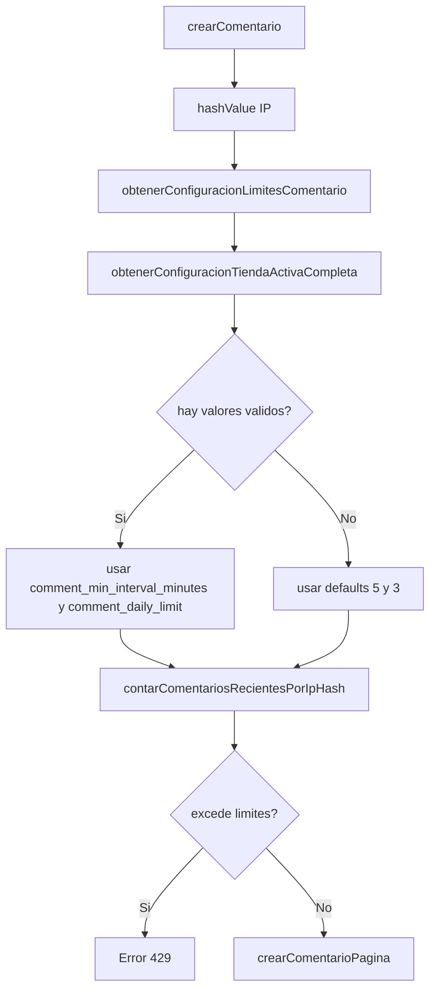
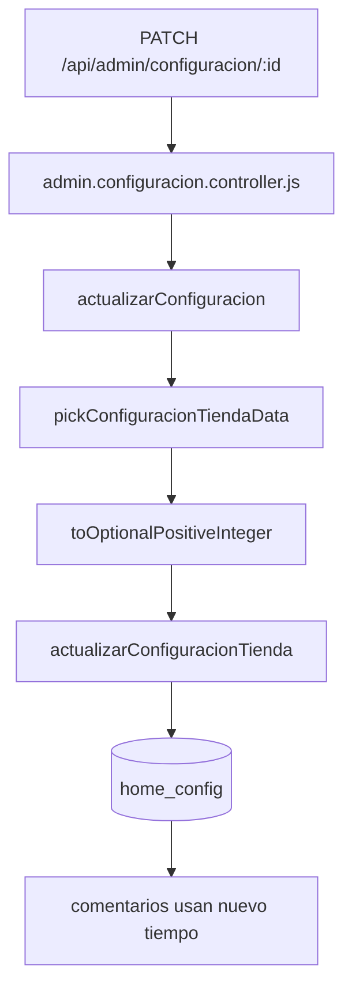
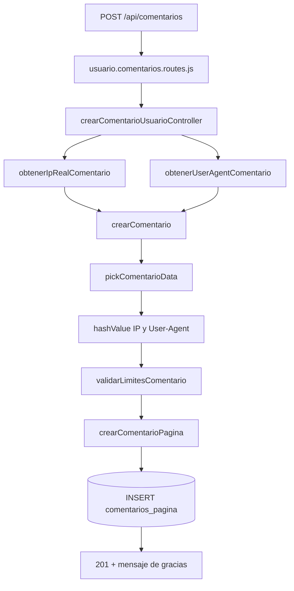
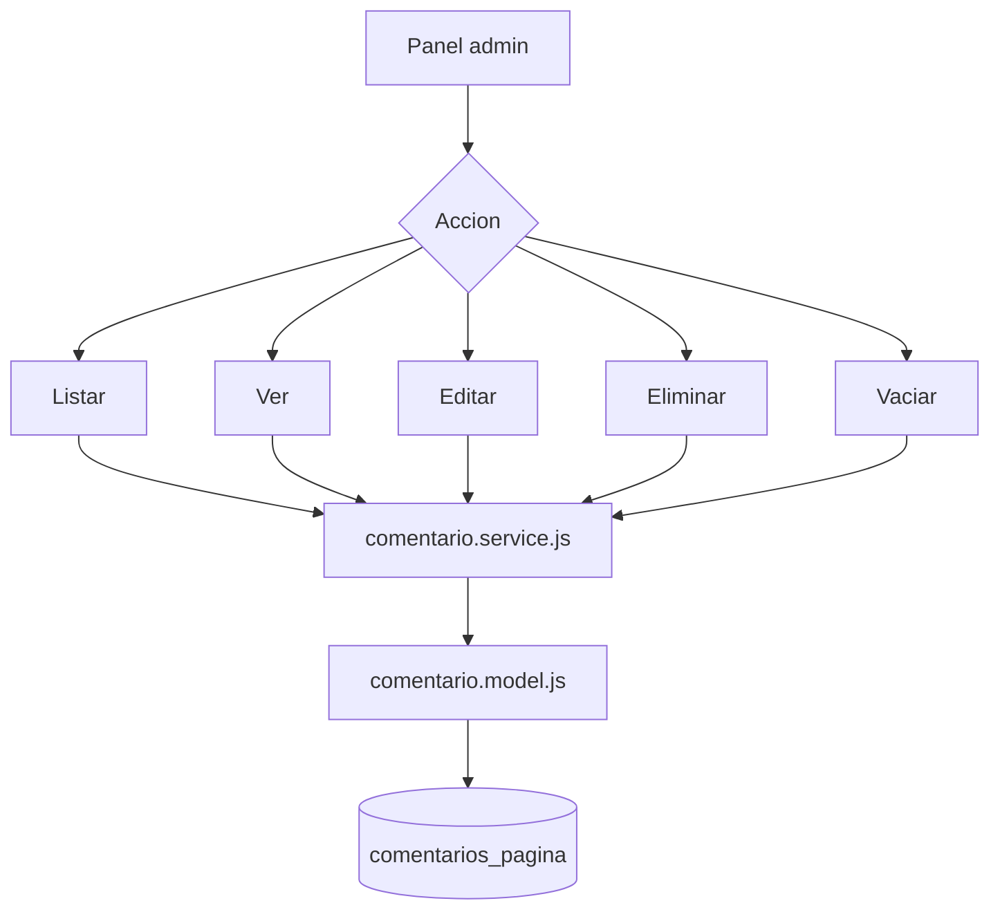
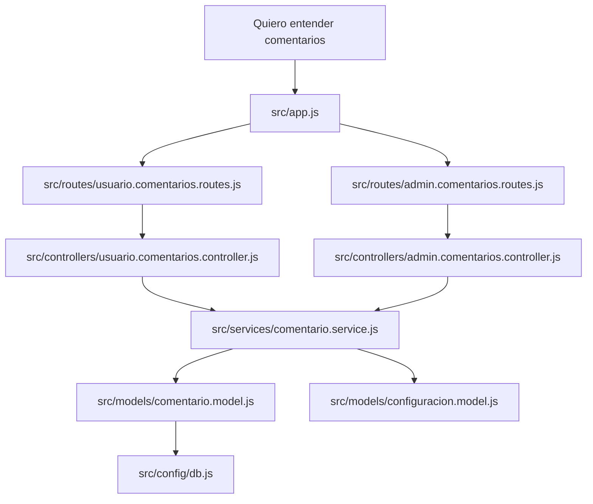

# Guia comentarios de pagina con graficos

Objetivo: entender rapido como funciona el modulo de comentarios, que rutas existen, que archivos toca, que funciones se usan, que seguridad anti-spam tiene y como modificar sus tiempos.

> Nota: en `src/app.js` la ruta admin tiene TODO de proteger con `authMiddleware` y rol admin.

## Mapa rapido



Idea central:

| Actor | Puede hacer |
|---|---|
| Usuario publico | Crear comentario |
| Admin | Listar, ver, editar, eliminar y vaciar |
| Backend | Ocultar IP real, generar hashes y limitar spam |

## Rutas

Publico:

| Metodo | Endpoint | Para que sirve | Controller |
|---|---|---|---|
| POST | `/api/comentarios` | Crear comentario desde la pagina | `crearComentarioUsuarioController` |

Admin:

| Metodo | Endpoint | Para que sirve | Controller |
|---|---|---|---|
| GET | `/api/admin/comentarios` | Listar comentarios | `listarComentariosAdminController` |
| GET | `/api/admin/comentarios/:id` | Ver comentario por id | `obtenerComentarioAdminPorIdController` |
| PUT | `/api/admin/comentarios/:id` | Editar comentario | `actualizarComentarioAdminController` |
| PATCH | `/api/admin/comentarios/:id` | Editar comentario parcial | `actualizarComentarioAdminController` |
| DELETE | `/api/admin/comentarios/:id` | Eliminar un comentario | `eliminarComentarioAdminController` |
| DELETE | `/api/admin/comentarios/vaciar` | Vaciar tabla completa | `vaciarComentariosAdminController` |

## Archivos y funciones

| Capa | Archivo | Funciones |
|---|---|---|
| Montaje | `src/app.js` | `app.use("/api/comentarios", comentariosRoutes)`, `app.use("/api/admin/comentarios", adminComentariosRoutes)` |
| Route publico | `src/routes/usuario.comentarios.routes.js` | `router.post("/")` |
| Route admin | `src/routes/admin.comentarios.routes.js` | `router.get("/")`, `router.delete("/vaciar")`, `router.get("/:id")`, `router.put("/:id")`, `router.patch("/:id")`, `router.delete("/:id")` |
| Controller publico | `src/controllers/usuario.comentarios.controller.js` | `crearComentarioUsuarioController` |
| Controller admin | `src/controllers/admin.comentarios.controller.js` | `listarComentariosAdminController`, `obtenerComentarioAdminPorIdController`, `actualizarComentarioAdminController`, `eliminarComentarioAdminController`, `vaciarComentariosAdminController` |
| Service | `src/services/comentario.service.js` | `obtenerIpRealComentario`, `obtenerUserAgentComentario`, `crearComentario`, `obtenerComentariosAdmin`, `obtenerComentarioAdmin`, `actualizarComentarioAdmin`, `eliminarComentarioAdmin`, `vaciarComentariosAdmin` |
| Model | `src/models/comentario.model.js` | `listarComentariosPagina`, `obtenerComentarioPaginaPorId`, `crearComentarioPagina`, `contarComentariosRecientesPorIpHash`, `actualizarComentarioPagina`, `eliminarComentarioPagina`, `vaciarComentariosPagina` |
| Configuracion | `src/models/configuracion.model.js` | `obtenerConfiguracionTiendaActivaCompleta` |
| Respuesta | `src/utils/response.js` | `successResponse` |
| Errores | `src/middlewares/error.middleware.js` | `errorMiddleware` |
| Entorno | `.env` | `COMMENT_HASH_SECRET` |

## Tabla `comentarios_pagina`

```sql
CREATE TABLE comentarios_pagina (
  id SERIAL PRIMARY KEY,
  texto TEXT NOT NULL,
  ip_hash VARCHAR(128) NOT NULL,
  user_agent_hash VARCHAR(128),
  creado_en TIMESTAMP DEFAULT CURRENT_TIMESTAMP
);
```

Indices recomendados:

```sql
CREATE INDEX idx_comentarios_pagina_ip_hash_creado_en
ON comentarios_pagina (ip_hash, creado_en);

CREATE INDEX idx_comentarios_pagina_creado_en
ON comentarios_pagina (creado_en);
```

Campos visibles en respuestas:

| Campo | Publico/Admin |
|---|---|
| `id` | Si |
| `texto` | Si |
| `creado_en` | Si |
| `ip_hash` | No |
| `user_agent_hash` | No |

## Seguridad implementada



El usuario solo envia:

```json
{
  "texto": "Quiero consultar por un repuesto"
}
```

El backend calcula:

| Dato | De donde sale |
|---|---|
| IP real | headers/request |
| User-Agent | header `user-agent` |
| `ip_hash` | HMAC-SHA-256 con `COMMENT_HASH_SECRET` |
| `user_agent_hash` | HMAC-SHA-256 con `COMMENT_HASH_SECRET` |

Orden para obtener IP:



En codigo, el orden real es:

```txt
cf-connecting-ip
x-real-ip
x-forwarded-for
req.ip
req.socket.remoteAddress
```

## Variable secreta

Requerida en `.env`:

```env
COMMENT_HASH_SECRET=un_texto_largo_secreto_y_dificil_de_adivinar
```

Si falta:

```json
{
  "ok": false,
  "message": "Configuracion de comentarios incompleta"
}
```

Regla importante:

| Accion | Efecto |
|---|---|
| Mantener `COMMENT_HASH_SECRET` | Mantiene continuidad del limite por IP |
| Cambiar `COMMENT_HASH_SECRET` | Los hashes nuevos ya no coinciden con los anteriores |
| Borrar `COMMENT_HASH_SECRET` | No se pueden crear comentarios |

## Tiempos anti-spam

Valores actuales por defecto:

| Limite | Campo config | Default |
|---|---|---|
| Minutos entre comentarios | `comment_min_interval_minutes` | `5` |
| Maximo en 24 horas | `comment_daily_limit` | `3` |

Flujo:



SQL de conteo:

```sql
SELECT
  COUNT(*) FILTER (
    WHERE creado_en >= NOW() - ($2 * INTERVAL '1 minute')
  )::int AS ultimos_intervalo,
  COUNT(*) FILTER (
    WHERE creado_en >= NOW() - INTERVAL '24 hours'
  )::int AS ultimas_24_horas
FROM comentarios_pagina
WHERE ip_hash = $1;
```

Regla:

| Condicion | Resultado |
|---|---|
| `ultimosIntervalo >= 1` | Bloquea |
| `ultimas24Horas >= dailyLimit` | Bloquea |
| Ninguna se cumple | Guarda comentario |

Mensaje al bloquear:

```json
{
  "ok": false,
  "message": "Ya recibimos tu sugerencia. Podras enviar otra mas adelante.",
  "pagination": null
}
```

## Como modificar los tiempos

Los tiempos se cambian en la configuracion activa de tienda, no en el frontend.

Campos:

| Campo | Que controla | Tipo |
|---|---|---|
| `comment_min_interval_minutes` | Minutos minimos entre comentarios de la misma IP hash | entero positivo |
| `comment_daily_limit` | Cantidad maxima por IP hash en 24 horas | entero positivo |

Ruta admin para editar configuracion:

```http
PATCH /api/admin/configuracion/:id
```

Ejemplo: permitir 1 comentario cada 10 minutos y maximo 5 al dia.

```http
PATCH /api/admin/configuracion/1
Content-Type: application/json
```

```json
{
  "comment_min_interval_minutes": 10,
  "comment_daily_limit": 5
}
```

Flujo de modificacion:



Donde se valida:

| Archivo | Funcion |
|---|---|
| `src/services/configuracion.service.js` | `pickConfiguracionTiendaData` |
| `src/services/configuracion.service.js` | `toOptionalPositiveInteger` |
| `src/services/comentario.service.js` | `obtenerConfiguracionLimitesComentario` |

Si se envia `0`, negativo, decimal o texto no numerico, se rechaza porque debe ser entero positivo.

## Crear comentario publico

Ruta:

```http
POST /api/comentarios
```

Body:

```json
{
  "texto": "Quiero consultar por un repuesto"
}
```

Flujo:



Respuesta:

```json
{
  "ok": true,
  "data": {
    "message": "gracias por registrar tu comentario.",
    "comentario": {
      "id": 1,
      "texto": "Quiero consultar por un repuesto",
      "creado_en": "2026-05-29T23:30:00.000Z"
    }
  },
  "pagination": null
}
```

## Admin comentarios

Mapa:



Funciones por accion:

| Accion | Service | Model |
|---|---|---|
| Listar | `obtenerComentariosAdmin` | `listarComentariosPagina` |
| Ver | `obtenerComentarioAdmin` | `obtenerComentarioPaginaPorId` |
| Editar | `actualizarComentarioAdmin` | `actualizarComentarioPagina` |
| Eliminar | `eliminarComentarioAdmin` | `eliminarComentarioPagina` |
| Vaciar | `vaciarComentariosAdmin` | `vaciarComentariosPagina` |

## SQL principal

Listar:

```sql
SELECT id, texto, creado_en
FROM comentarios_pagina
ORDER BY creado_en DESC, id DESC;
```

Ver:

```sql
SELECT id, texto, creado_en
FROM comentarios_pagina
WHERE id = $1
LIMIT 1;
```

Crear:

```sql
INSERT INTO comentarios_pagina (texto, ip_hash, user_agent_hash)
VALUES ($1, $2, $3)
RETURNING id;
```

Editar:

```sql
UPDATE comentarios_pagina
SET texto = $1
WHERE id = $2
RETURNING id;
```

Eliminar:

```sql
DELETE FROM comentarios_pagina
WHERE id = $1
RETURNING id, texto, creado_en;
```

Vaciar:

```sql
TRUNCATE TABLE comentarios_pagina RESTART IDENTITY;
```

## Errores comunes

| Error | Causa | Solucion |
|---|---|---|
| `texto es obligatorio` | Body sin `texto` o vacio | Enviar texto con contenido |
| `Ya recibimos tu sugerencia...` | Anti-spam activo | Esperar o cambiar tiempos en configuracion |
| `Configuracion de comentarios incompleta` | Falta `COMMENT_HASH_SECRET` | Agregar variable en `.env` |
| `id de comentario invalido` | `id` no es entero positivo | Usar id valido |
| `Comentario no encontrado` | El id no existe | Revisar listado admin |

## Pendientes recomendados

| Pendiente | Motivo |
|---|---|
| Proteger `/api/admin/comentarios` | Evitar acceso publico al panel admin |
| Agregar paginacion admin | Si llegan muchos comentarios |
| Agregar limite de longitud de `texto` | Evitar textos enormes |
| Rotar `COMMENT_HASH_SECRET` con cuidado | Cambia continuidad de limites por IP |

## Como leer el codigo sin perderse



Regla simple:

| Si quieres ver... | Abre... |
|---|---|
| URLs publicas | `src/routes/usuario.comentarios.routes.js` |
| URLs admin | `src/routes/admin.comentarios.routes.js` |
| Respuesta al usuario | `src/controllers/usuario.comentarios.controller.js` |
| Seguridad, hashes y limites | `src/services/comentario.service.js` |
| SQL real | `src/models/comentario.model.js` |
| Cambiar tiempos | `src/services/configuracion.service.js` y `/api/admin/configuracion/:id` |

