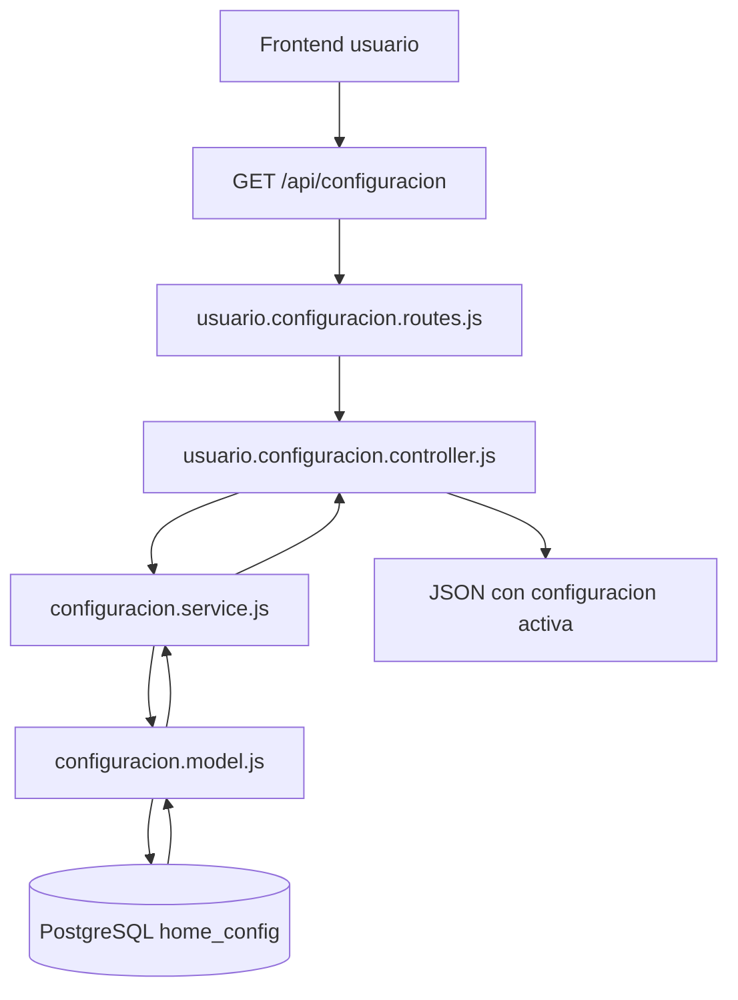
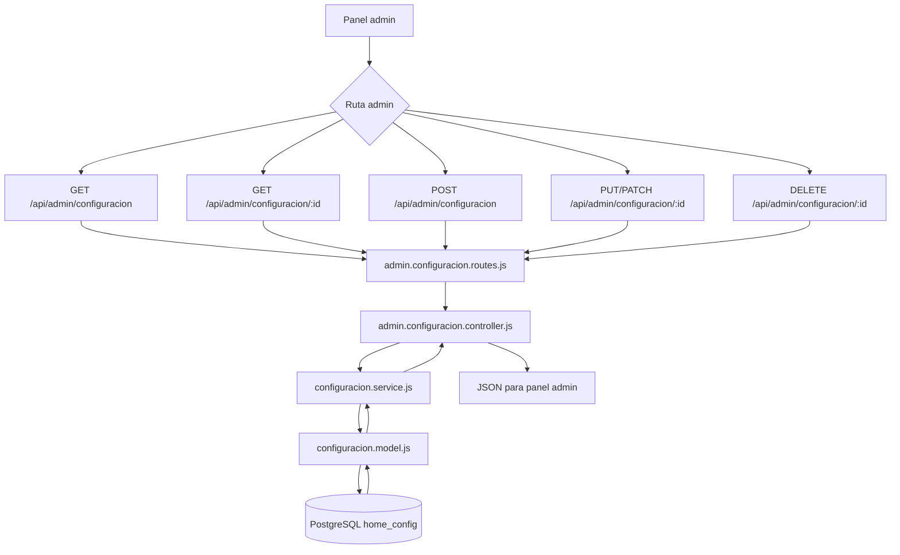
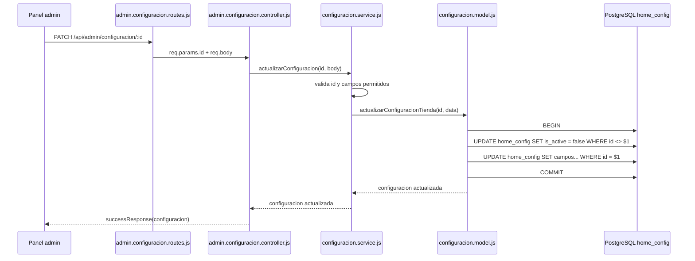

# Guia de configuracion admin y usuario

Esta guia explica como funciona el modulo de configuracion de la tienda, que rutas expone, que archivos usa y como viajan los datos entre el frontend, Express y PostgreSQL.

El modulo trabaja sobre la tabla:

```txt
home_config
```

La idea principal es:

```txt
admin administra todas las configuraciones
usuario solo consume la configuracion activa
```

## Campos de la tabla

Columnas usadas actualmente por la API:

```txt
id
banner_primary_message
banner_secondary_message
banner_tertiary_message
banner_subtitle
banner_title
header_help_label
header_location_label
header_location_sub_label
header_phone_label
header_primary_message
header_schedule_friday
header_schedule_saturday
header_shipping_badge
header_secondary_message
header_whatsapp_label
header_whatsapp_sub_label
header_whatsapp_url
location_display_address
location_display_district
seller_whatsapp_url
is_active
```

`is_active` indica que configuracion debe cargar el frontend publico.

Recomendacion de base de datos:

```sql
ALTER TABLE home_config
ALTER COLUMN is_active SET DEFAULT FALSE;

CREATE UNIQUE INDEX unique_active_home_config
ON home_config (is_active)
WHERE is_active = true;
```

Con este indice PostgreSQL evita que existan dos configuraciones activas al mismo tiempo.

## Rutas publicas

### Obtener configuracion activa

```http
GET /api/configuracion
```

Uso:

```txt
frontend de usuario
home publico
header publico
banner publico
botones de WhatsApp y ubicacion
```

Respuesta:

```json
{
  "ok": true,
  "data": {
    "id": 1,
    "banner_primary_message": "Compra online y recoge en taller",
    "banner_secondary_message": "Con envios",
    "banner_tertiary_message": "Recojo en tienda",
    "banner_subtitle": "Piezas seleccionadas y verificadas para tu vehiculo",
    "banner_title": "REPUESTOS USADOS IMPORTADOS",
    "header_help_label": "Necesitas ayuda?",
    "header_location_label": "Ubicacion",
    "header_location_sub_label": "Ver en mapa",
    "header_phone_label": "+51 924 516 682",
    "header_primary_message": "Compra online y recoge en taller",
    "header_schedule_friday": "Lun - Vie: 8:00 am - 6:00 pm",
    "header_schedule_saturday": "Sab: 8:00 am - 1:00 pm",
    "header_shipping_badge": "con envios",
    "header_secondary_message": "Solo recojo en tienda",
    "header_whatsapp_label": "WhatsApp",
    "header_whatsapp_sub_label": "Atencion rapida",
    "header_whatsapp_url": "https://wa.me/51924516682",
    "location_display_address": "Av. Los Proceres 123",
    "location_display_district": "San Martin de Porres, Lima",
    "seller_whatsapp_url": "https://wa.me/51924516682",
    "is_active": true
  },
  "pagination": null
}
```

Si no hay configuracion activa:

```json
{
  "ok": true,
  "data": null,
  "pagination": null
}
```

## Rutas admin

Base:

```http
/api/admin/configuracion
```

### Listar configuraciones

```http
GET /api/admin/configuracion
```

Devuelve todas las filas de `home_config`.

Uso:

```txt
panel admin
tabla de configuraciones
seleccionar cual editar o activar
```

### Obtener configuracion por id

```http
GET /api/admin/configuracion/:id
```

Ejemplo:

```http
GET /api/admin/configuracion/1
```

Devuelve una sola configuracion.

### Crear configuracion

```http
POST /api/admin/configuracion
```

Ejemplo de body:

```json
{
  "banner_title": "REPUESTOS USADOS IMPORTADOS",
  "banner_subtitle": "Piezas seleccionadas y verificadas para tu vehiculo",
  "banner_primary_message": "Compra online y recoge en taller",
  "banner_secondary_message": "Con envios",
  "banner_tertiary_message": "Recojo en tienda",
  "header_help_label": "Necesitas ayuda?",
  "header_location_label": "Ubicacion",
  "header_location_sub_label": "Ver en mapa",
  "header_phone_label": "+51 924 516 682",
  "header_primary_message": "Compra online y recoge en taller",
  "header_schedule_friday": "Lun - Vie: 8:00 am - 6:00 pm",
  "header_schedule_saturday": "Sab: 8:00 am - 1:00 pm",
  "header_shipping_badge": "con envios",
  "header_secondary_message": "Solo recojo en tienda",
  "header_whatsapp_label": "WhatsApp",
  "header_whatsapp_sub_label": "Atencion rapida",
  "header_whatsapp_url": "https://wa.me/51924516682",
  "location_display_address": "Av. Los Proceres 123",
  "location_display_district": "San Martin de Porres, Lima",
  "seller_whatsapp_url": "https://wa.me/51924516682",
  "is_active": false
}
```

Si no mandas `is_active`, el service lo guarda como `false`.

Si mandas:

```json
{
  "is_active": true
}
```

el modelo primero desactiva las otras configuraciones y luego crea esta como activa.

### Editar configuracion

```http
PUT /api/admin/configuracion/:id
PATCH /api/admin/configuracion/:id
```

Ejemplo:

```http
PATCH /api/admin/configuracion/2
```

Body parcial:

```json
{
  "banner_title": "REPUESTOS IMPORTADOS SOSAIMPOR",
  "is_active": true
}
```

Cuando `is_active` llega como `true`, el modelo ejecuta esta regla:

```txt
1. desactiva las demas configuraciones
2. actualiza la configuracion seleccionada
3. devuelve la configuracion actualizada
```

### Eliminar configuracion

```http
DELETE /api/admin/configuracion/:id
```

Ejemplo:

```http
DELETE /api/admin/configuracion/3
```

Elimina la fila y devuelve la configuracion eliminada.

Importante:

```txt
si eliminas la configuracion activa, el frontend publico devolvera data: null
hasta que actives otra configuracion
```

## Archivos usados

| Archivo | Uso |
| --- | --- |
| `src/app.js` | Monta las rutas publicas y admin |
| `src/routes/usuario.configuracion.routes.js` | Define `GET /api/configuracion` |
| `src/controllers/usuario.configuracion.controller.js` | Responde la configuracion activa para el frontend |
| `src/routes/admin.configuracion.routes.js` | Define CRUD admin de configuracion |
| `src/controllers/admin.configuracion.controller.js` | Recibe peticiones admin y llama al service |
| `src/services/configuracion.service.js` | Valida ids, filtra campos permitidos, normaliza strings y booleanos |
| `src/models/configuracion.model.js` | Ejecuta SQL contra `home_config` |
| `src/config/db.js` | Expone el pool de PostgreSQL |
| `src/utils/response.js` | Envuelve respuestas exitosas con `successResponse` |

## Diagrama general



## Diagrama admin



## Diagrama de activacion

Este flujo pasa cuando admin crea o edita una configuracion con `is_active: true`.



## Flujo publico por capas

```txt
GET /api/configuracion
  -> src/routes/usuario.configuracion.routes.js
  -> src/controllers/usuario.configuracion.controller.js
  -> obtenerConfiguracionPublicaTienda()
  -> obtenerConfiguracionTiendaActiva()
  -> SELECT ... FROM home_config WHERE is_active = true LIMIT 1
  -> successResponse(configuracion)
```

## Flujo admin por capas

Listar:

```txt
GET /api/admin/configuracion
  -> listarConfiguracionesAdminController()
  -> obtenerConfiguracionesTienda()
  -> listarConfiguracionesTienda()
  -> SELECT ... FROM home_config ORDER BY id ASC
```

Obtener por id:

```txt
GET /api/admin/configuracion/:id
  -> obtenerConfiguracionAdminPorIdController()
  -> obtenerConfiguracionTienda(id)
  -> obtenerConfiguracionTiendaPorId(id)
  -> SELECT ... FROM home_config WHERE id = $1 LIMIT 1
```

Crear:

```txt
POST /api/admin/configuracion
  -> crearConfiguracionAdminController()
  -> crearConfiguracion(body)
  -> pickConfiguracionTiendaData(body)
  -> crearConfiguracionTienda(data)
  -> INSERT INTO home_config (...)
```

Editar:

```txt
PUT/PATCH /api/admin/configuracion/:id
  -> actualizarConfiguracionAdminController()
  -> actualizarConfiguracion(id, body)
  -> pickConfiguracionTiendaData(body)
  -> actualizarConfiguracionTienda(id, data)
  -> UPDATE home_config SET ...
```

Eliminar:

```txt
DELETE /api/admin/configuracion/:id
  -> eliminarConfiguracionAdminController()
  -> eliminarConfiguracion(id)
  -> eliminarConfiguracionTienda(id)
  -> DELETE FROM home_config WHERE id = $1
```

## Validaciones actuales

El service hace estas validaciones:

```txt
id debe ser entero positivo
solo se guardan campos permitidos
strings vacios se rechazan
is_active acepta boolean true/false o strings "true", "false", "1", "0", "si", "no"
si una edicion no trae campos validos, devuelve error
```

## Recomendaciones para frontend

Panel admin:

```txt
usar GET /api/admin/configuracion para tabla/listado
usar GET /api/admin/configuracion/:id para cargar formulario de edicion
usar POST para crear configuracion nueva
usar PATCH para editar pocos campos
usar DELETE para eliminar
mandar is_active: true cuando el admin seleccione cual usar en el frontend
```

Frontend publico:

```txt
consumir solo GET /api/configuracion
no decidir por id en el frontend publico
mostrar fallback si data viene null
```

## Pendientes recomendados

Antes de produccion:

```txt
proteger /api/admin/configuracion con autenticacion
proteger /api/admin/configuracion con rol admin
confirmar el indice unico para una sola configuracion activa
decidir si se permite eliminar la configuracion activa
agregar tests de crear, activar, listar, editar y eliminar
```
