# Guia tecnica con graficos: filtracion y paginacion de productos

Objetivo: entender rapido como funciona `GET /api/productos`, que archivos usa, que funciones se ejecutan, como filtra y como pagina sin traer todos los productos.

## Mapa rapido

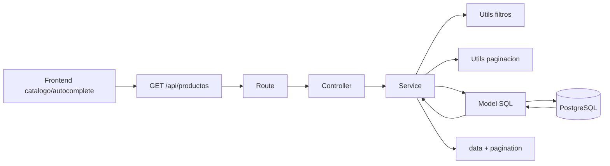

## Rutas

| Metodo | Endpoint | Para que sirve | Funcion controller |
|---|---|---|---|
| GET | `/api/productos` | Listado publico con filtros y paginacion | `listarProductos` |
| GET | `/api/productos/filtros-opciones` | Opciones para combos de filtros | `listarFiltrosProductos` |
| GET | `/api/productos/:slug` | Detalle publico de un producto | `obtenerProductoPorSlugController` |

Ejemplos:

```http
GET /api/productos?page=1&limit=12
GET /api/productos?search=toyota&page=1&limit=4
GET /api/productos?marca=Toyota&precio_min=100&precio_max=800
GET /api/productos/filtros-opciones
GET /api/productos/faro-delantero-toyota
```

## Archivos y funciones

| Capa | Archivo | Funciones |
|---|---|---|
| Montaje | `src/app.js` | `app.use("/api/productos", productosRoutes)` |
| Route | `src/routes/usuario.productos.routes.js` | `router.get("/")`, `router.get("/filtros-opciones")`, `router.get("/:slug")` |
| Controller | `src/controllers/usuario.productos.controller.js` | `listarProductos`, `listarFiltrosProductos`, `obtenerProductoPorSlugController` |
| Service | `src/services/usuario.productos.service.js` | `obtenerProductos`, `obtenerFiltrosProductos`, `obtenerProductoPorSlug` |
| Filtros | `src/utils/filters.js` | `getProductFilters` |
| Paginacion | `src/utils/pagination.js` | `getPagination` |
| Model | `src/models/productos.model.js` | `listarProductosFiltrados`, `obtenerOpcionesFiltrosProductos`, `obtenerProductoPublicoPorSlug` |
| Respuesta | `src/utils/response.js` | `successResponse` |
| DB | `src/config/db.js` | `pool` |

## Flujo de listado

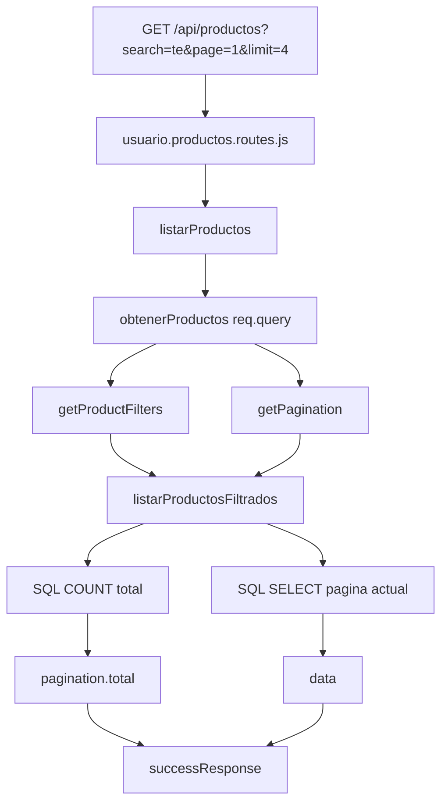

## Que hace cada capa

| Capa | Responsabilidad |
|---|---|
| Route | Decide que URL llama a que controller |
| Controller | Lee `req.query` o `req.params` y responde JSON |
| Service | Convierte filtros, calcula paginacion y arma metadata |
| Utils | Limpia tipos: texto, numero, booleano, page, limit, offset |
| Model | Construye SQL seguro con parametros `$1`, `$2`, etc. |
| DB | Devuelve filas reales desde PostgreSQL |

## Filtros soportados

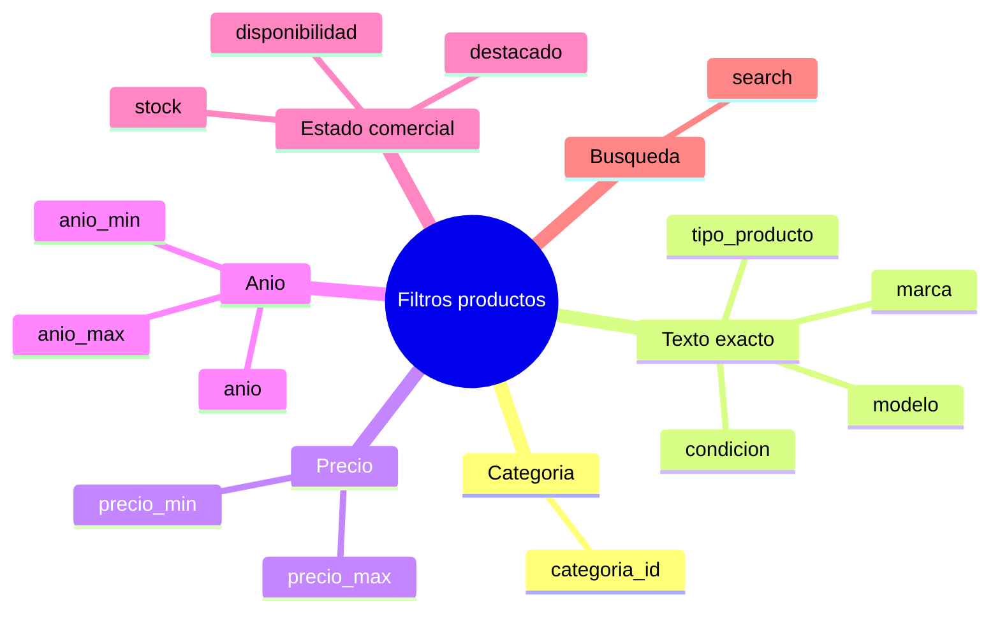

Tabla tecnica:

| Query param | Tipo interno | Regla SQL |
|---|---|---|
| `categoria_id` | numero | `p.categoria_id = valor` |
| `marca` | texto | `LOWER(p.marca) = LOWER(valor)` |
| `modelo` | texto | `LOWER(p.modelo) = LOWER(valor)` |
| `tipo_producto` | texto | `LOWER(p.tipo_producto) = LOWER(valor)` |
| `condicion` | texto | `p.condicion = valor` |
| `precio_min` | numero | `p.precio >= valor` |
| `precio_max` | numero | `p.precio <= valor` |
| `stock` | numero | `p.stock = valor` |
| `anio` | numero | `p.anio = valor` |
| `anio_min` | numero | `p.anio >= valor` |
| `anio_max` | numero | `p.anio <= valor` |
| `destacado` | booleano | `p.destacado = valor` |
| `disponibilidad` | texto | `disponible` o `proximamente` |
| `search` | texto | `ILIKE` en varios campos |

## Limpieza de filtros

`getProductFilters(query)` convierte lo que llega por URL:

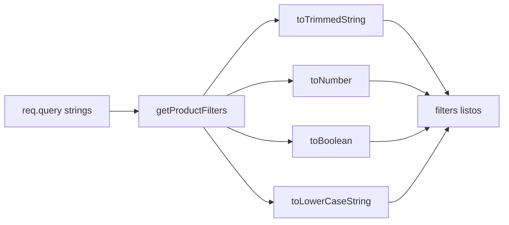

Ejemplos:

| En URL | Interno |
|---|---|
| `"1"` | `1` |
| `"100"` | `100` |
| `"true"` | `true` |
| `""` | `null` |
| `" Toyota "` | `"Toyota"` |

## Paginacion

`getPagination(query)` evita traer todos los productos.

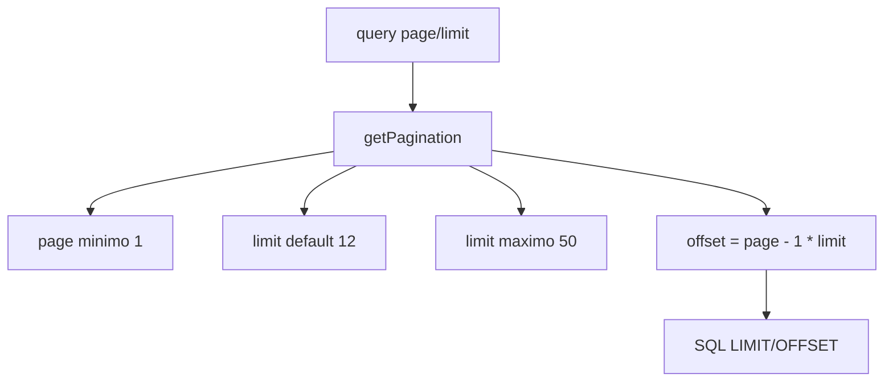

Reglas:

| Campo | Regla |
|---|---|
| `page` | minimo `1` |
| `limit` | default `12` |
| `limit` maximo | `50` |
| `offset` | `(page - 1) * limit` |

Ejemplo:

```http
GET /api/productos?page=2&limit=12
```

Resultado interno:

```json
{
  "page": 2,
  "limit": 12,
  "offset": 12
}
```

## SQL seguro

El model no concatena valores directos en el SQL. Usa arrays:

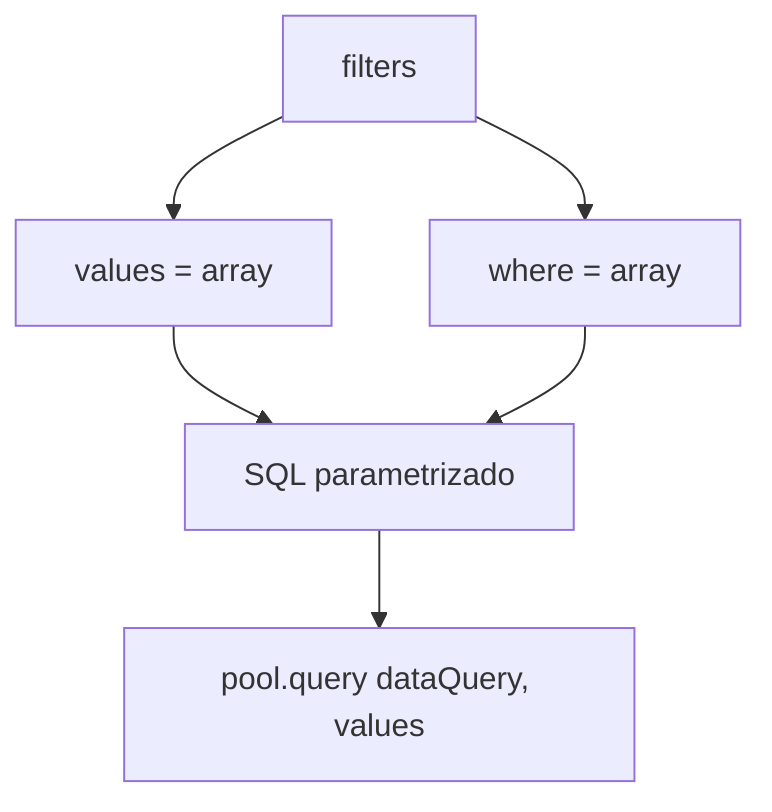

Base publica obligatoria:

```sql
p.activo = true
AND EXISTS (
  SELECT 1
  FROM categorias categoria_publica
  WHERE categoria_publica.id = p.categoria_id
    AND categoria_publica.activa = true
)
```

Eso significa:

| Caso | Aparece en API publica |
|---|---|
| Producto activo + categoria activa | Si |
| Producto inactivo | No |
| Categoria inactiva | No |
| Producto guardado para admin | Sigue existiendo, pero no sale publico |

## Busqueda `search`

`search` usa coincidencia parcial con `ILIKE`.

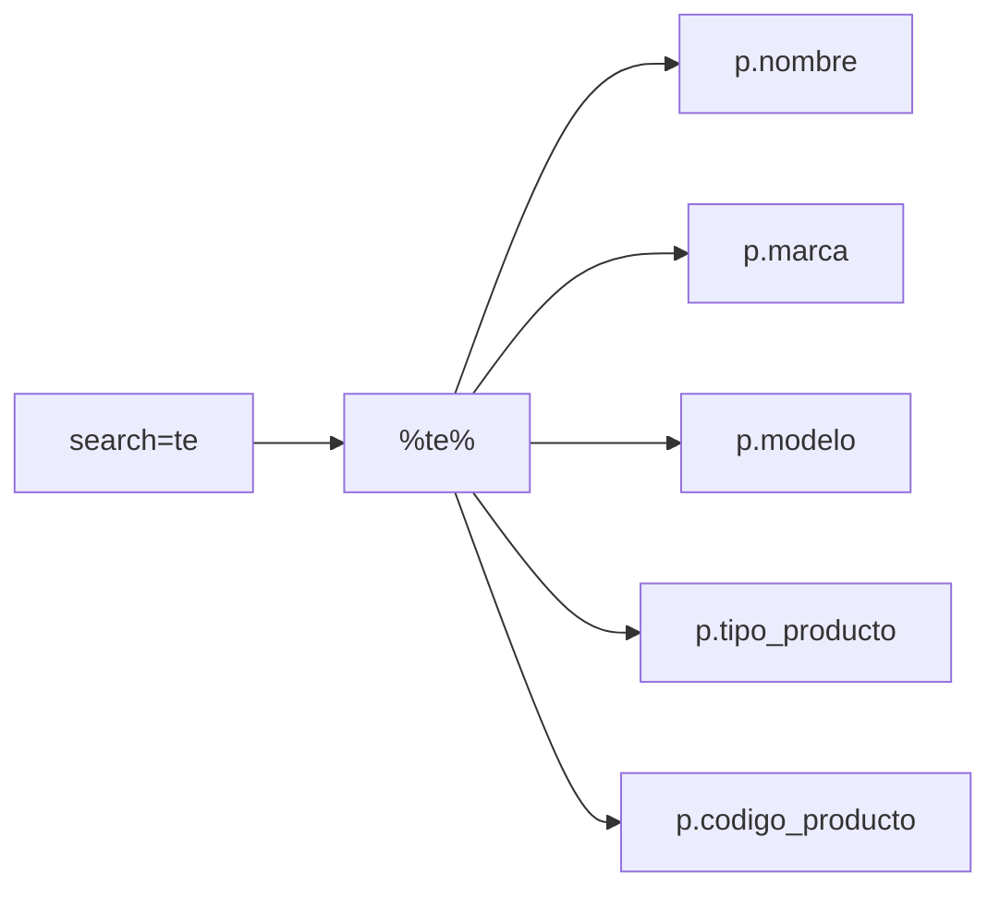

Campos actuales:

| Campo | Busca aqui |
|---|---|
| Nombre | `p.nombre ILIKE` |
| Marca | `p.marca ILIKE` |
| Modelo | `p.modelo ILIKE` |
| Tipo | `p.tipo_producto ILIKE` |
| Codigo | `p.codigo_producto ILIKE` |

No busca en `descripcion`; eso ayuda a que el autocomplete no sea demasiado amplio.

## Consulta doble

Para devolver metadata de paginacion se hacen dos consultas:

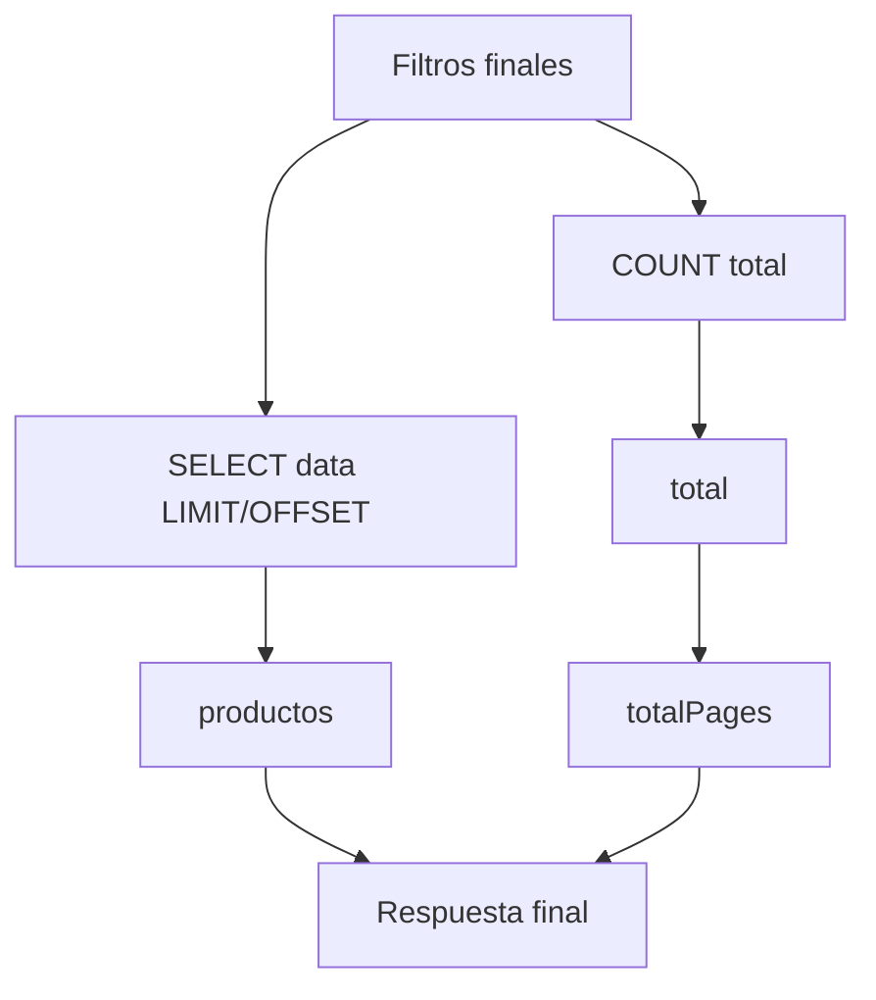

Consulta 1:

```sql
SELECT COUNT(*)::int AS total
FROM productos p
WHERE ...
```

Consulta 2:

```sql
SELECT ...
FROM productos p
LEFT JOIN categorias c ON c.id = p.categoria_id
WHERE ...
ORDER BY p.destacado DESC, p.creado_en DESC
LIMIT $n
OFFSET $n
```

## Respuesta del listado

```json
{
  "ok": true,
  "data": [],
  "pagination": {
    "page": 1,
    "limit": 12,
    "total": 0,
    "totalPages": 0,
    "hasNextPage": false,
    "hasPrevPage": false
  }
}
```

## Opciones de filtros

Ruta:

```http
GET /api/productos/filtros-opciones
```

Flujo:

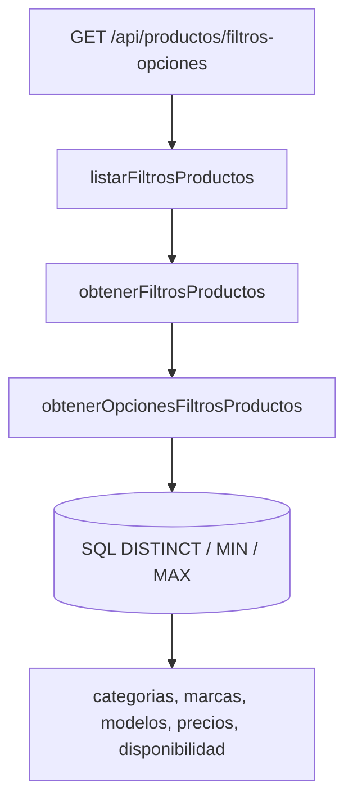

Devuelve opciones para:

| Opcion | Fuente |
|---|---|
| `categorias` | categorias activas con productos activos |
| `marcas` | `DISTINCT p.marca` |
| `modelos` | `DISTINCT p.modelo` |
| `tipos_producto` | `DISTINCT p.tipo_producto` |
| `condiciones` | `DISTINCT p.condicion` |
| `anios` | `DISTINCT p.anio` |
| `precios` | `MIN(p.precio)` y `MAX(p.precio)` |
| `disponibilidad` | existe stock o proximamente |

## Detalle por slug

Ruta:

```http
GET /api/productos/:slug
```

Flujo:

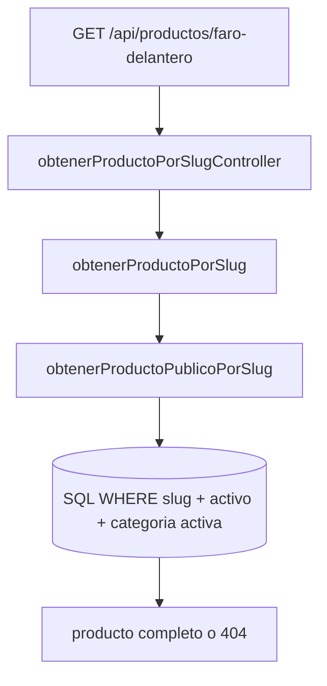

Reglas:

| Regla | Resultado |
|---|---|
| Slug vacio | Error `400` |
| No existe producto publico | Error `404` |
| Existe y esta visible | JSON con producto |

## Autocomplete

Usa la misma ruta de listado, solo con `limit` pequeno.

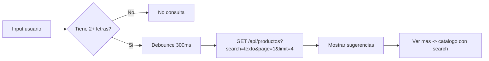

Recomendado:

| Caso | URL |
|---|---|
| Sugerencias | `/api/productos?search=toy&page=1&limit=4` |
| Catalogo | `/api/productos?search=toy&page=1&limit=12` |
| Ver mas | Frontend navega a `/productos?search=toy` |

## Rendimiento

| Punto | Estado actual |
|---|---|
| No traer todo | Si, usa `LIMIT/OFFSET` |
| Maximo por pagina | `50` |
| Default por pagina | `12` |
| Autocomplete liviano | Usar `limit=4` o `limit=5` |
| Seguridad SQL | Usa parametros en `pool.query` |
| Visibilidad publica | Filtra producto activo y categoria activa en backend |

## Como agregar un filtro nuevo

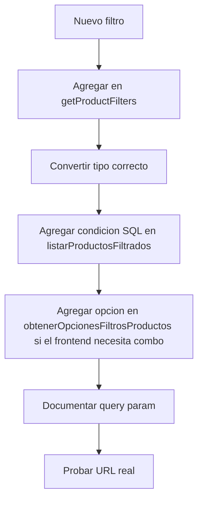

Checklist:

| Paso | Archivo |
|---|---|
| Crear query param | `src/utils/filters.js` |
| Convertir tipo | `getProductFilters` |
| Agregar WHERE | `src/models/productos.model.js` |
| Agregar combo opcional | `obtenerOpcionesFiltrosProductos` |
| Mantener paginacion | `getPagination` ya lo hace |
| Documentar | esta guia |

## Como leer el codigo sin perderse

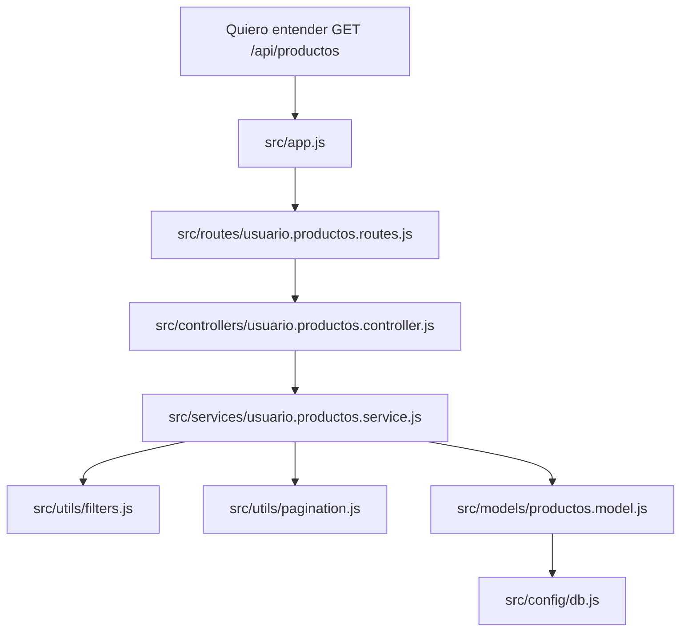

Regla simple:

| Si quieres ver... | Abre... |
|---|---|
| La URL | `src/routes/usuario.productos.routes.js` |
| La respuesta JSON | `src/controllers/usuario.productos.controller.js` |
| La logica de filtros + pagination | `src/services/usuario.productos.service.js` |
| Conversion de query params | `src/utils/filters.js` |
| Limites `page/limit` | `src/utils/pagination.js` |
| SQL real | `src/models/productos.model.js` |

